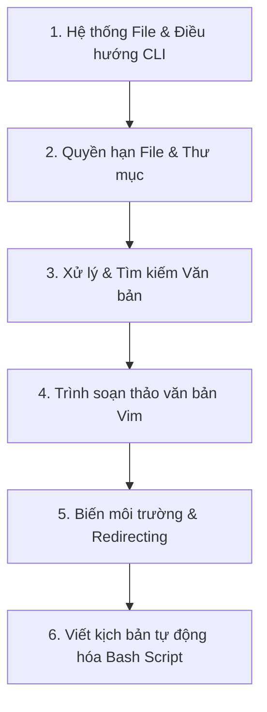

# Lộ trình Học Linux & Bash Shell Scripting cho Data Engineer

Hệ điều hành Linux (đặc biệt là Ubuntu) là môi trường vận hành của hầu hết các hệ thống dữ liệu hiện đại, Docker containers và máy chủ Cloud. Thành thạo dòng lệnh Linux và viết kịch bản tự động hóa bằng Bash (Shell Scripting) kết hợp trình soạn thảo văn bản Vim là kỹ năng bắt buộc đối với mọi Data Engineer.

---

## 📌 Khung kiến thức chính (Syllabus)

---

## 🗓️ Các bước học tập chi tiết (Step-by-step Agenda)

### Bước 1: Điều hướng CLI & Quản lý File (Tuần 1 - Ngày 1 đến Ngày 2)
*   **Nội dung:**
    *   Cấu trúc thư mục chuẩn của Linux (FHS): `/etc`, `/var`, `/home`, `/tmp`, `/bin`.
    *   Các lệnh điều hướng và quản lý tệp tin: `pwd`, `cd`, `ls` (các tùy chọn `-l`, `-a`, `-h`), `mkdir`, `rm` (tùy chọn `-rf`), `cp`, `mv`.
    *   Xem nội dung tệp tin nhanh: `cat`, `less`, `head`, `tail` (theo dõi log thời gian thực với `tail -f`).
*   **Tài liệu học tập:**
    *   [Linux Journey: Command Line Basics](https://linuxjourney.com/lesson/the-shell)
    *   [TLDR Pages (Giải thích lệnh ngắn gọn)](https://tldr.sh/)

### Bước 2: Phân quyền File & Quản lý Người dùng (Tuần 1 - Ngày 3)
*   **Nội dung:**
    *   Hiểu 3 nhóm quyền: Owner (u), Group (g), Others (o) và các quyền Read (r=4), Write (w=2), Execute (x=1).
    *   Thay đổi quyền hạn file: `chmod` (ví dụ: `chmod +x script.sh`, `chmod 755 file.txt`).
    *   Thay đổi chủ sở hữu file: `chown` (ví dụ: `chown root:root backup.tar.gz`).
*   **Tài liệu học tập:**
    *   [Linux Journey: File Permissions](https://linuxjourney.com/lesson/file-permissions)

### Bước 3: Tìm kiếm & Xử lý Văn bản nâng cao (Tuần 1 - Ngày 4 đến Ngày 5)
*   **Nội dung:**
    *   Tìm kiếm tệp tin theo tên, kích thước, thời gian sửa đổi: `find` (ví dụ: `find /data -name "*.csv"`).
    *   Tìm kiếm mẫu văn bản bên trong tệp tin: `grep` (ví dụ: `grep -rn "ERROR" /var/log/`).
    *   Bộ lọc và xử lý dòng văn bản cơ bản: `wc` (đếm dòng/từ), `sort` (sắp xếp), `uniq` (lọc trùng).
    *   Đường ống liên kết lệnh: Pipe (`|`) để truyền đầu ra của lệnh này làm đầu vào cho lệnh khác.

### Bước 4: Trình soạn thảo văn bản Vim (Tuần 2 - Ngày 1)
*   **Nội dung:**
    *   Sự khác nhau giữa các chế độ: Normal Mode (chế độ điều hướng), Insert Mode (chế độ chèn văn bản), Command-line Mode (chế độ dòng lệnh).
    *   Các lệnh mở file, sửa đổi, sao chép (`yy`), cắt/xóa (`dd`), dán (`p`), tìm kiếm từ khóa (`/`), và thoát lưu (`:wq`) hoặc hủy lưu (`:q!`).
*   **Tài liệu học tập:**
    *   Chạy chương trình tự học trực quan bằng lệnh: `vimtutor` trực tiếp trên Terminal Linux.
    *   [Interactive Vim Tutorial](https://www.openvim.com/)

### Bước 5: Biến môi trường & Dẫn hướng luồng (Redirection) (Tuần 2 - Ngày 2)
*   **Nội dung:**
    *   Biến môi trường (Environment Variables): Xem với `env` hoặc `printenv`, khai báo tạm thời với `export`, và khai báo vĩnh viễn trong file `.bashrc` / `.zshrc`.
    *   Dẫn hướng luồng dữ liệu (Input/Output Redirection):
        *   Ghi đè đầu ra vào file: `>`
        *   Ghi nối tiếp (append) vào cuối file: `>>`
        *   Bắt lỗi stderr và ghi ra file: `2>` hoặc `2>&1`.

### Bước 6: Viết kịch bản tự động hóa Bash Script (Tuần 2 - Ngày 3 đến Tuần 3)
*   **Nội dung:**
    *   Khai báo dòng chỉ thị trình biên dịch (Shebang): `#!/bin/bash`.
    *   Khai báo biến trong Bash, xử lý tham số đầu vào (`$1`, `$2`, `$@`).
    *   Cấu trúc rẽ nhánh `if-else`, vòng lặp `for`, `while`.
    *   Gọi và bắt lỗi từ các lệnh hệ thống.
*   **Bài tập thực hành:**
    *   👉 **[Lab 1: Các câu lệnh Linux cơ bản & Giám sát hệ thống](labs/lab_1_linux_basics.md)** (40 bài tập về Thư mục, Phân quyền, Lọc văn bản và Tiến trình).
    *   👉 **[Lab 2: Trình soạn thảo văn bản Vim](labs/lab_2_vim.md)** (10 bài tập điều hướng và chỉnh sửa văn bản CLI).
    *   👉 **[Lab 3: SSH, Mạng & Truyền tải tệp tin từ xa](labs/lab_3_ssh_networking.md)** (10 bài tập tải dữ liệu, nén file, và truyền dữ liệu qua SSH/SCP/Rsync).

---

## 🎯 Đánh giá cuối Giai đoạn
Sau khi hoàn thành các bước tự học và bài thực hành trên, Intern cần chủ động ôn tập và kiểm tra lại kiến thức dựa trên tài liệu checklist:
*   👉 **[Checklist Kiến thức cần nắm được - Linux & Bash Shell](knowledge_checklist.md)**

