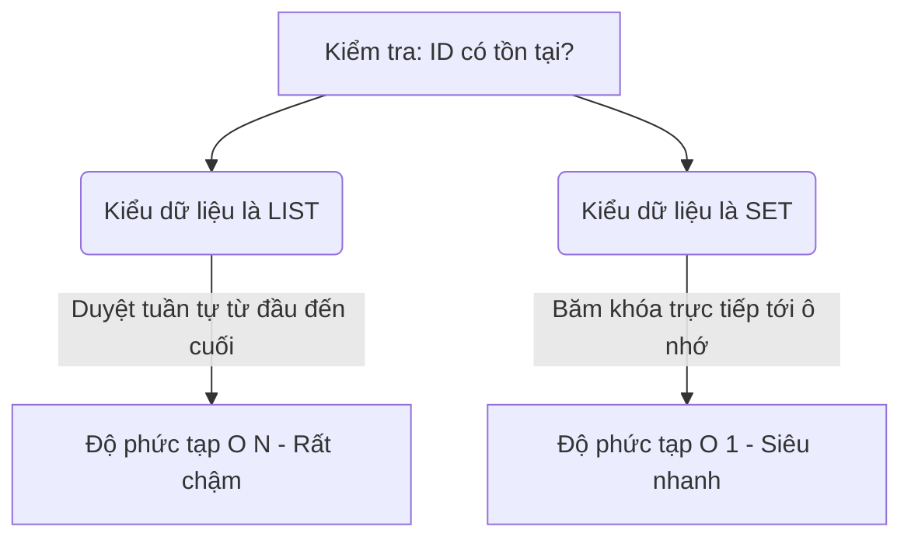

# 📝 Lab 1: Các bài tập cơ bản về cấu trúc dữ liệu và logic Python

Bài thực hành này được thiết kế để rèn luyện tư duy lập trình và xử lý dữ liệu cơ bản cho Intern. Tài liệu được chia làm 5 phần tương ứng với các cấu trúc dữ liệu chính. Mỗi phần đều có giải thích lý thuyết thực tế trong Data Engineering, các bài tập đi kèm **sắp xếp theo mức độ khó tăng dần (từ Dễ đến Khó)**, và danh sách các bài luyện tập thêm trên LeetCode.

---

## 📌 Mục lục các phần học
1.  **Phần 1: Lists & Tuples** (Độ khó tăng dần từ 1.1 đến 1.5 + LeetCode)
2.  **Phần 2: Dictionaries** (Độ khó tăng dần từ 2.1 đến 2.5 + LeetCode)
3.  **Phần 3: Sets - Tập hợp** (Độ khó tăng dần từ 3.1 đến 3.10 + LeetCode)
4.  **Phần 4: Strings - Xử lý chuỗi** (Độ khó tăng dần từ 4.1 đến 4.5 + LeetCode)
5.  **Phần 5: Datetime & Logic phân trang** (Độ khó tăng dần từ 5.1 đến 5.5 + LeetCode)

---

## 1. Lists & Tuples

### 💡 Tại sao quan trọng trong Data Engineering?
*   **List (Danh sách):** Dùng để chứa một hàng đợi các bản ghi dữ liệu (ví dụ: một danh sách các bản ghi JSON vừa đọc từ API).
*   **Tuple (Bộ dữ liệu):** Dùng để chứa các bộ hằng số hoặc cấu hình cố định chiếm ít bộ nhớ hơn và không thể bị sửa đổi vô tình trong thời gian chạy (như `(db_host, db_port)`).

### ✍️ Bài tập thực hành (Độ khó tăng dần):

#### [Cấp độ: Rất dễ] Bài tập 1.1: Đảo ngược thứ tự log
Danh sách log sự kiện nhận về theo thứ tự từ cũ nhất đến mới nhất: `event_logs = ["User Login", "View Product", "Add to Cart", "Checkout"]`.  
*Yêu cầu:* Đảo ngược danh sách trên để hiển thị sự kiện mới nhất lên đầu.

#### [Cấp độ: Dễ] Bài tập 1.2: Lọc giao dịch giá trị cao
Cho danh sách giao dịch: `transactions = [120.5, 45.0, 300.2, 15.8, 99.9, 500.0]`.  
*Yêu cầu:* Lọc và tạo một danh sách mới chứa các giao dịch lớn hơn `100.0` sử dụng `list comprehension`.

#### [Cấp độ: Trung bình - Dễ] Bài tập 1.3: Trích xuất tọa độ bản đồ
Cho danh sách các địa điểm dạng Tuple: `locations = [("Hanoi", 21.0285, 105.8542), ("Saigon", 10.8231, 106.6297)]`.  
*Yêu cầu:* Duyệt qua danh sách, unpack từng tuple tọa độ và in ra chuỗi định dạng: `"Thành phố: {tên} - Kinh độ: {lon} - Vĩ độ: {lat}"`.

#### [Cấp độ: Trung bình] Bài tập 1.4: Phân tích chỉ số cảm biến
Cho danh sách nhiệt độ từ cảm biến IoT gửi về: `temps = [23.5, 25.0, 19.8, 32.4, 28.1, 15.2, 30.0]`.  
*Yêu cầu:* Không dùng thư viện ngoài, viết vòng lặp tìm nhiệt độ cao nhất, thấp nhất và tính nhiệt độ trung bình của danh sách.

#### [Cấp độ: Khó] Bài tập 1.5: Thuật toán gom nhóm dữ liệu (Batching / Chunking)
Khi ingest dữ liệu vào database, ta thường gom nhóm danh sách hàng triệu bản ghi thành từng lô nhỏ (chunks) để tránh quá tải bộ nhớ.  
Cho danh sách ID: `ids = [1, 2, 3, 4, 5, 6, 7, 8, 9, 10, 11, 12, 13]`.  
*Yêu cầu:* Chia danh sách `ids` trên thành các danh sách con, mỗi danh sách con chứa tối đa 5 phần tử.  
*Kết quả mong muốn:* `[[1, 2, 3, 4, 5], [6, 7, 8, 9, 10], [11, 12, 13]]`.

### 🏆 Các bài luyện tập bổ sung trên LeetCode:
*   [LeetCode 1: Two Sum](https://leetcode.com/problems/two-sum/) (Cấp độ: Dễ - Rèn luyện tìm kiếm chỉ số trong mảng)
*   [LeetCode 26: Remove Duplicates from Sorted Array](https://leetcode.com/problems/remove-duplicates-from-sorted-array/) (Cấp độ: Dễ - Rèn luyện duyệt mảng và tối ưu in-place pointer)
*   [LeetCode 189: Rotate Array](https://leetcode.com/problems/rotate-array/) (Cấp độ: Trung bình - Luyện kỹ năng slicing mảng nâng cao)

---

## 2. Dictionaries

### 💡 Tại sao quan trọng trong Data Engineering?
Dictionary (cấu trúc key-value) là nền tảng để lưu trữ dữ liệu bán cấu trúc (JSON) và cấu hình hệ thống. Nó cho phép truy xuất thông tin cực nhanh bằng key với độ phức tạp $O(1)$.

### ✍️ Bài tập thực hành (Độ khó tăng dần):

#### [Cấp độ: Rất dễ] Bài tập 2.1: Khởi tạo bảng danh mục
Cho hai danh sách song song: `keys = ["id", "name", "role"]` và `values = [1001, "Nguyen Van A", "Data Engineer"]`.  
*Yêu cầu:* Ghép hai danh sách này thành một Dictionary duy nhất.

#### [Cấp độ: Dễ] Bài tập 2.2: Hợp nhất cấu hình hệ thống (Config Merge)
Hợp nhất cấu hình mặc định (default config) và cấu hình môi trường cụ thể (env config).  
```python
default_config = {"db_host": "localhost", "db_port": 5432, "timeout": 30}
env_config = {"db_host": "192.168.1.5", "timeout": 60}
```
*Yêu cầu:* Hợp nhất 2 dictionary trên làm một sao cho cấu hình trong `env_config` ghi đè lên `default_config` nếu trùng key.

#### [Cấp độ: Trung bình - Dễ] Bài tập 2.3: Đếm tần suất mã lỗi HTTP
Cho danh sách mã lỗi ghi nhận từ log: `status_codes = [200, 404, 500, 200, 404, 200, 500, 500, 200]`.  
*Yêu cầu:* Tạo một Dictionary đếm số lần xuất hiện của từng mã lỗi.  
*Kết quả mong muốn:* `{200: 4, 404: 2, 500: 3}`.

#### [Cấp độ: Trung bình] Bài tập 2.4: Phân nhóm sản phẩm theo danh mục (Aggregation)
Cho danh sách sản phẩm:
```python
items = [
    {"name": "Laptop", "category": "Electronics"},
    {"name": "Shirt", "category": "Clothing"},
    {"name": "Phone", "category": "Electronics"},
    {"name": "Jeans", "category": "Clothing"}
]
```
*Yêu cầu:* Phân nhóm các sản phẩm này thành một Dictionary có cấu trúc gom nhóm dạng: `{"Electronics": ["Laptop", "Phone"], "Clothing": ["Shirt", "Jeans"]}`.

#### [Cấp độ: Khó] Bài tập 2.5: Truy xuất dữ liệu lồng nhau an toàn (Nested JSON Parsing)
Khi parse JSON từ API, nếu một key bị thiếu, code truy xuất trực tiếp dạng `data["user"]["profile"]["age"]` sẽ quăng lỗi `KeyError` và crash pipeline.  
Cho dictionary: `user_profile = {"name": "Binh", "details": {"education": "Bachelor"}}`.  
*Yêu cầu:* Hãy viết code truy xuất an toàn thông tin trường `age` nằm sâu trong `details` -> `profile` -> `age` (key này không tồn tại). Nếu không thấy, trả về giá trị mặc định là `Unknown` mà không crash code.

### 🏆 Các bài luyện tập bổ sung trên LeetCode:
*   [LeetCode 13: Roman to Integer](https://leetcode.com/problems/roman-to-integer/) (Cấp độ: Dễ - Dùng dictionary để tra cứu ánh xạ)
*   [LeetCode 387: First Unique Character in a String](https://leetcode.com/problems/first-unique-character-in-a-string/) (Cấp độ: Dễ - Rèn luyện đếm tần suất ký tự bằng hash map)
*   [LeetCode 49: Group Anagrams](https://leetcode.com/problems/group-anagrams/) (Cấp độ: Trung bình - Phân nhóm chuỗi sử dụng dictionary key)

---

## 3. Sets (Tập hợp)

### 💡 Tại sao sử dụng Set trong Data Engineering?
Set là một cấu trúc tập hợp chứa các phần tử **duy nhất** và **không có thứ tự**. Trong Data Engineering, Set được ưu tiên sử dụng hàng đầu vì:
1.  **Loại bỏ trùng lặp (Deduplication) siêu tốc:** Ép kiểu sang Set (`set(data_list)`) giúp lọc bỏ các phần tử trùng lặp ngay lập tức nhờ thuật toán băm (hashing).
2.  **Độ phức tạp tìm kiếm $O(1)$ thay vì $O(N)$:** Nhờ cơ chế **Bảng băm (Hash Table)**, Python tính toán trực tiếp vị trí lưu trữ của phần tử đó và tìm ra kết quả ngay lập tức với độ phức tạp **$O(1)$** (chỉ mất đúng 1 bước tính toán, không phụ thuộc vào kích thước tập dữ liệu lớn thế nào).



### ✍️ 10 Bài tập thực tế về Set (Độ khó tăng dần):

#### [Cấp độ: Rất dễ] Bài tập 3.1: Loại bỏ ID giao dịch trùng (Deduplication)
Cho danh sách ID giao dịch đọc từ file log:  
`raw_ids = [901, 902, 901, 903, 904, 902, 905, 901]`.  
*Yêu cầu:* Loại bỏ các phần tử trùng lặp và in ra tập hợp ID duy nhất.

#### [Cấp độ: Rất dễ] Bài tập 3.2: Tìm khách hàng đăng ký chéo kênh (Cross-channel Users)
*   Email đăng ký qua Web: `web_emails = {"an@gmail.com", "binh@gmail.com", "chi@gmail.com"}`  
*   Email đăng ký qua App: `app_emails = {"binh@gmail.com", "dung@gmail.com", "an@gmail.com"}`  
*Yêu cầu:* Tìm các email đăng ký ở cả hai kênh dùng toán tử giao (`&`).

#### [Cấp độ: Dễ] Bài tập 3.3: Tìm khách hàng không hoạt động (Churn Detection)
*   Tập hợp tất cả khách hàng đăng ký: `all_customers = {"C01", "C02", "C03", "C04", "C05", "C06"}`  
*   Tập hợp khách hàng có giao dịch trong tháng: `active_customers = {"C02", "C05"}`  
*Yêu cầu:* Tìm ra danh sách các khách hàng không có giao dịch nào trong tháng dùng toán tử hiệu (`-`).

#### [Cấp độ: Dễ] Bài tập 3.4: Phân nhóm thiết bị truy cập (Browser Segment Diff)
*   Trình duyệt của người dùng Web: `web_browsers = {"Chrome", "Firefox", "Safari", "Edge"}`  
*   Trình duyệt của người dùng Mobile: `mobile_browsers = {"Safari", "Chrome", "Samsung Internet"}`  
*Yêu cầu:* Tìm các trình duyệt chỉ có người dùng Web sử dụng mà người dùng Mobile không dùng.

#### [Cấp độ: Dễ] Bài tập 3.5: Hợp nhất tập khách hàng từ các chiến dịch tiếp thị
*   Chiến dịch 1: `camp_1 = {"a@gmail.com", "b@gmail.com"}`  
*   Chiến dịch 2: `camp_2 = {"b@gmail.com", "c@gmail.com"}`  
*   Chiến dịch 3: `camp_3 = {"c@gmail.com", "d@gmail.com", "a@gmail.com"}`  
*Yêu cầu:* Tạo một tập hợp duy nhất chứa toàn bộ email từ cả 3 chiến dịch dùng toán tử hợp (`|`).

#### [Cấp độ: Trung bình - Dễ] Bài tập 3.6: Xác định dữ liệu mới để Ingest (Incremental Load Check)
*   Danh sách ID đã có trong DB: `db_ids = {101, 102, 103, 104, 105}`
*   Danh sách ID mới tải về từ API: `new_api_ids = [103, 104, 106, 107]`  
*Yêu cầu:* Tìm danh sách các ID mới thực sự cần được thêm (INSERT) vào DB.

#### [Cấp độ: Trung bình - Dễ] Bài tập 3.7: Phát hiện mất dữ liệu giao dịch (Data Loss Detection)
*   ID giao dịch ở cổng thanh toán: `payment_gateway_ids = {5001, 5002, 5003, 5004, 5005}`  
*   ID giao dịch ghi nhận trong DB: `database_ids = {5001, 5003, 5005}`  
*Yêu cầu:* Tìm ra các ID giao dịch bị thiếu trong DB.

#### [Cấp độ: Trung bình] Bài tập 3.8: Lọc bỏ từ cấm (Stopwords / Blacklist Filtering)
*   Tập hợp từ khóa cấm: `blacklist = {"spam", "ads", "fake"}`  
*   Danh sách từ khóa nhận về: `user_tags = ["data", "spam", "python", "ads", "pipeline"]`  
*Yêu cầu:* Lọc bỏ các từ nằm trong blacklist ra khỏi danh sách `user_tags` bằng cách kiểm tra thành viên với Set.

#### [Cấp độ: Trung bình - Khó] Bài tập 3.9: Kiểm tra cấu trúc File đầu vào (Schema Validation)
ETL nhận file CSV và cần kiểm tra xem các tiêu đề cột (columns) trong file CSV tải lên có đầy đủ các cột bắt buộc hay không.  
*   Các cột bắt buộc phải có: `required_columns = {"transaction_id", "amount", "customer_id", "date"}`  
*   Các cột đọc được từ file CSV tải lên hôm nay: `uploaded_columns = {"transaction_id", "amount", "device_type"}`  
*Yêu cầu:* Kiểm tra xem file tải lên bị thiếu những cột bắt buộc nào.

#### [Cấp độ: Khó] Bài tập 3.10: Kiểm tra tính toàn vẹn khóa ngoại (Referential Integrity Check)
Trước khi join Fact với Dimension, ta cần kiểm tra xem tất cả các ID liên kết ở Fact có tồn tại hợp lệ trong bảng Dim hay không.  
*   Tập hợp ID thành phố hợp lệ trong Dimension Table: `dim_city_ids = {1, 2, 3, 4, 5}`  
*   Danh sách ID thành phố ghi nhận tại Fact Table: `fact_city_ids = [1, 2, 9, 3, 10, 4]`  
*Yêu cầu:* Tìm ra các ID thành phố xuất hiện ở Fact Table nhưng không tồn tại trong Dimension Table để cảnh báo lỗi dữ liệu.

### 🏆 Các bài luyện tập bổ sung trên LeetCode:
*   [LeetCode 217: Contains Duplicate](https://leetcode.com/problems/contains-duplicate/) (Cấp độ: Dễ - Dùng set để phát hiện phần tử trùng nhanh nhất)
*   [LeetCode 349: Intersection of Two Arrays](https://leetcode.com/problems/intersection-of-two-arrays/) (Cấp độ: Dễ - Rèn luyện tìm kiếm phần chung)
*   [LeetCode 128: Longest Consecutive Sequence](https://leetcode.com/problems/longest-consecutive-sequence/) (Cấp độ: Trung bình - Ứng dụng Set để tìm phần tử kế tiếp trong O(1) time)

---

## 4. Strings (Xử lý chuỗi)

### 💡 Tại sao quan trọng trong Data Engineering?
Dữ liệu dạng chuỗi (String) nhận từ log, CSV hay Web Scraper thường bị "bẩn". Kỹ sư dữ liệu bắt buộc phải làm sạch chuỗi trước khi lưu trữ vào Database để đảm bảo dữ liệu chuẩn hóa.

### ✍️ Bài tập thực hành (Độ khó tăng dần):

#### [Cấp độ: Rất dễ] Bài tập 4.1: Kiểm tra định dạng tệp tin cho phép
Cho đường dẫn file: `file_path = "/data/storage/2026/sales_report.csv"`  
*Yêu cầu:* Trích xuất phần mở rộng (đuôi file) của tệp tin trên và kiểm tra xem nó có nằm trong danh sách cho phép `["csv", "parquet"]` hay không.

#### [Cấp độ: Dễ] Bài tập 4.2: Chuẩn hóa họ tên (Title Case)
Tên người dùng nhập vào hệ thống thường bị gõ sai chữ hoa chữ thường:  
`raw_name = "ngUYen VaN a"`  
*Yêu cầu:* Chuẩn hóa chuỗi trên về dạng viết hoa chữ cái đầu của mỗi từ.

#### [Cấp độ: Trung bình - Dễ] Bài tập 4.3: Định dạng tiền tệ hiển thị
Cho số: `amount = 1500000`  
*Yêu cầu:* Định dạng số trên thành chuỗi ngăn cách hàng nghìn bằng dấu phẩy: `"1,500,000"`.

#### [Cấp độ: Trung bình] Bài tập 4.4: Loại bỏ khoảng trắng thừa đầu cuối và khoảng trắng kép
Cho chuỗi: `messy_address = "   123   Nguyen  Trai   Street,  Hanoi   "`  
*Yêu cầu:* Dọn dẹp chuỗi trên sao cho loại bỏ khoảng trắng ở hai đầu, và các khoảng trắng kép ở giữa từ chỉ giữ lại duy nhất một khoảng trắng đơn.

#### [Cấp độ: Khó] Bài tập 4.5: Phân tích dòng log máy chủ (Log Parser)
Cho một dòng log máy chủ web dạng chuỗi thô:  
`log_line = "IP:192.168.1.1|METHOD:GET|STATUS:200|PATH:/index.html"`  
*Yêu cầu:* Phân tích chuỗi trên và chuyển thành một Dictionary có cấu trúc:  
`{"ip": "192.168.1.1", "method": "GET", "status": 200, "path": "/index.html"}` (Lưu ý trường status phải là kiểu số nguyên `int`).

### 🏆 Các bài luyện tập bổ sung trên LeetCode:
*   [LeetCode 58: Length of Last Word](https://leetcode.com/problems/length-of-last-word/) (Cấp độ: Dễ - Dùng hàm tách chuỗi split)
*   [LeetCode 125: Valid Palindrome](https://leetcode.com/problems/valid-palindrome/) (Cấp độ: Dễ - Làm sạch khoảng trắng/ký tự đặc biệt và so khớp)
*   [LeetCode 14: Longest Common Prefix](https://leetcode.com/problems/longest-common-prefix/) (Cấp độ: Dễ - Xử lý chuỗi tiền tố)

---

## 5. Datetime & Logic phân trang

### 💡 Tại sao quan trọng trong Data Engineering?
*   **Datetime (Thời gian):** Mọi sự kiện dữ liệu trong thế giới Big Data đều có mốc thời gian xảy ra (Timestamp). Chúng ta sử dụng datetime để phân vùng dữ liệu (Partitioning) và tính toán khoảng thời gian.
*   **Phân trang (Pagination):** Dùng để gọi dữ liệu từ API theo từng trang (ví dụ: 100 bản ghi mỗi trang) tránh quá tải máy chủ.

### ✍️ Bài tập thực hành (Độ khó tăng dần):

#### [Cấp độ: Dễ] Bài tập 5.1: Chuẩn hóa ngày tháng về ISO format
`dates = ["2026/07/01", "02-07-2026", "2026-07-03"]`  
*Yêu cầu:* Hãy dùng thư viện `datetime` chuẩn hóa toàn bộ danh sách trên về chuỗi định dạng ISO chuẩn: `YYYY-MM-DD`.

#### [Cấp độ: Trung bình - Dễ] Bài tập 5.2: Tính toán thời gian hoàn thành (SLA)
*   Ngày đặt: `order_date = "2026-07-01 10:00:00"`
*   Ngày giao: `delivery_date = "2026-07-04 15:30:00"`  
*Yêu cầu:* Chuyển đổi các chuỗi trên thành datetime object và tính khoảng cách thời gian giao hàng (đơn vị: số ngày thực tế kèm phần lẻ giờ, ví dụ: 3.23 ngày).

#### [Cấp độ: Trung bình] Bài tập 5.3: Lọc giao dịch theo khung giờ hành chính
Cho danh sách giao dịch:
```python
txs = [
    {"id": "T1", "time": "2026-07-01 07:30:00"},
    {"id": "T2", "time": "2026-07-01 09:15:00"},
    {"id": "T3", "time": "2026-07-01 18:00:00"},
    {"id": "T4", "time": "2026-07-01 14:30:00"}
]
```
*Yêu cầu:* Lọc ra các giao dịch được thực hiện trong giờ hành chính (từ `08:00:00` đến `17:00:00` hàng ngày).

#### [Cấp độ: Trung bình - Khó] Bài tập 5.4: Kiểm tra năm nhuận tự viết
*Yêu cầu:* Viết hàm `is_leap_year(year: int) -> bool` kiểm tra một năm có phải năm nhuận hay không theo quy tắc: Năm chia hết cho 4 là năm nhuận, nhưng năm chia hết cho 100 thì không phải năm nhuận, ngoại trừ những năm chia hết cho 400 thì vẫn là năm nhuận.

#### [Cấp độ: Khó] Bài tập 5.5: Hàm phân trang dữ liệu (Pagination Slicing)
Cho danh sách log: `data_logs = [f"Log {i}" for i in range(1, 26)]` (Tạo danh sách từ Log 1 đến Log 25).  
*Yêu cầu:* Viết hàm `get_page(data: list, page_size: int, page_number: int) -> list` để lấy ra danh sách các phần tử của trang tương ứng.  
*Ví dụ:* `get_page(data_logs, page_size=10, page_number=2)` sẽ trả về danh sách các phần tử từ Log 11 đến Log 20. Nếu trang yêu cầu không có dữ liệu, trả về danh sách rỗng `[]`.

### 🏆 Các bài luyện tập bổ sung trên LeetCode:
*   [LeetCode 1154: Day of the Year](https://leetcode.com/problems/day-of-the-year/) (Cấp độ: Dễ - Xử lý parse chuỗi ngày đơn giản)
*   [LeetCode 1360: Number of Days Between Two Dates](https://leetcode.com/problems/number-of-days-between-two-dates/) (Cấp độ: Dễ - Tính khoảng cách ngày)
*   [LeetCode 48: Rotate Image](https://leetcode.com/problems/rotate-image/) (Cấp độ: Trung bình - Luyện thuật toán dịch chuyển index ma trận)

---

## 📥 Định nghĩa đầu ra & Sản phẩm bàn giao (Expected Outputs)

Sau khi hoàn thành viết toàn bộ mã nguồn của 30 bài tập trên vào file `basics_practice.py`, Intern chạy thử để kiểm tra kết quả in ra màn hình phải hiển thị đầy đủ và sạch sẽ thông tin kết quả của từng bài tập để Mentor dễ dàng kiểm tra.

---

## 📈 Tiêu chí đánh giá của Mentor (Validation Criteria)
1.  **Set Operations Efficiency:** Mentor kiểm tra các bài tập phần 3, đảm bảo Intern sử dụng các toán tử tập hợp (`&`, `-`, `^`, `|`) hoặc phương thức tương ứng của Set thay vì dùng vòng lặp lồng nhau hoặc List.
2.  **No KeyError in Dict parsing:** Bài tập 2.5 phải sử dụng phương thức `.get()` lồng nhau hoặc block `try-except` để tránh xảy ra lỗi runtime.
3.  **Correct Type Casting:** Các bài tập so sánh số học và thời gian phải được ép kiểu về đúng kiểu dữ liệu (`int`, `float`, `datetime`) trước khi so sánh, tuyệt đối không so sánh chuỗi thô.
