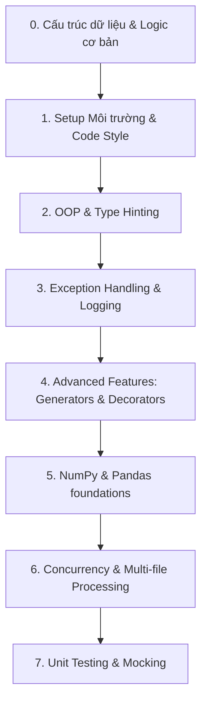

# Lộ trình Đào tạo Python cho Data Engineer

Tài liệu này cung cấp lộ trình chi tiết từng chủ đề và tài liệu học tập của phần học Python. Các bài thực hành chi tiết đã được tách thành các tệp tài liệu riêng dưới đây để dễ dàng theo dõi.

---

## 📌 Khung kiến thức chính (Syllabus)

---

## 🗓️ Các bước học tập chi tiết (Step-by-step Agenda)

### Bước 0: Làm quen với Cú pháp & Logic Python cơ bản (Tuần 1 - Ngày 1)
*   **Nội dung:**
    *   Các kiểu dữ liệu cơ bản: Biến, số nguyên, số thực, Boolean, Chuỗi.
    *   Các cấu trúc dữ liệu tích hợp sẵn: List, Tuple, Dictionary, Set. Cách truy xuất và thay đổi giá trị.
    *   Các cấu trúc điều khiển: Lệnh rẽ nhánh (`if-elif-else`), vòng lặp (`for`, `while`), từ khóa thoát vòng lặp (`break`, `continue`).
    *   Định nghĩa và gọi hàm (`def`, tham số đầu vào, giá trị trả về).
    *   Xử lý chuỗi (String manipulation: strip, split, join, lower, upper).
*   **Tài liệu học tập:**
    *   [W3Schools Python Tutorial](https://www.w3schools.com/python/)
    *   [Real Python: Python Basics](https://realpython.com/learning-paths/python-basics/)
*   **Bài tập thực hành:**
    *   👉 **[Lab 1: Cấu trúc dữ liệu & Logic Python cơ bản](file:///Users/ducdn/Desktop/Data%20Engineer/intern/01_python/labs/lab_1_basics.md)** (30 bài tập bao gồm List, Dict, Set, Strings, Datetime).

### Bước 1: Setup Môi trường & Code Style (Tuần 1 - Ngày 2 đến Ngày 3)
*   **Nội dung:**
    *   Cách tạo và kích hoạt Virtual Environment (`venv`, `poetry` hoặc `pipenv`). Tìm hiểu chi tiết nguyên nhân không nên cài thư viện global.
    *   Quy chuẩn viết code PEP 8: Đặt tên biến/hàm (snake_case), đặt tên class (PascalCase), độ dài dòng (<79 ký tự), import nhóm thư viện.
    *   Sử dụng các công cụ auto-format và check lỗi tự động: `black` (format), `isort` (sắp xếp imports), `flake8` (linter).
*   **Tài liệu học tập:**
    *   [PEP 8 -- Style Guide for Python Code](https://peps.python.org/pep-0008/)
    *   [Real Python: Python Virtual Environments Primer](https://realpython.com/python-virtual-environments-a-primer/)
*   **Bài tập thực hành:**
    *   👉 **[Lab 2: Python Scripting & Data Cleansing](file:///Users/ducdn/Desktop/Data%20Engineer/intern/01_python/labs/lab_2_json_cleansing.md)** (Làm sạch file JSON thô, xử lý SĐT/Email, ghi log và xuất CSV).

### Bước 2: Object-Oriented Programming (OOP) & Type Hinting (Tuần 1 - Ngày 4 đến Ngày 5)
*   **Nội dung:**
    *   **Class & Object:** Định nghĩa class, constructor `__init__`, các thuộc tính (instance vs class attributes).
    *   **Kế thừa (Inheritance) & Đa hình (Polymorphism):** Ví dụ định nghĩa lớp cha `BaseConnector` và các lớp con kế thừa `PostgresConnector`, `MySQLConnector`.
    *   **Encapsulation:** Sử dụng thuộc tính private/protected (`_` và `__`) và các `@property` decorator để quản lý getter/setter.
    *   **Type Hinting (`typing` module):** Viết kiểu dữ liệu cho tham số đầu vào và kiểu trả về của hàm (`def get_data(url: str) -> dict:`). Giúp IDE gợi ý code tốt hơn và phát hiện lỗi sớm.
*   **Tài liệu học tập:**
    *   [Real Python: OOP in Python 3](https://realpython.com/python3-object-oriented-programming/)
    *   [Python Type Hinting Guide](https://realpython.com/python-type-hints/)

### Bước 3: Exception Handling & Logging (Tuần 2 - Ngày 1 đến Ngày 2)
*   **Nội dung:**
    *   **Exception Handling:**
        *   Cơ chế try-except-finally. Tránh bắt exception chung chung kiểu `except Exception: pass`.
        *   Tạo Custom Exceptions kế thừa từ lớp `Exception` gốc để phân loại lỗi cụ thể (ví dụ: `DatabaseConnectionError`, `APIResponseError`).
    *   **Standard Logging:**
        *   Sử dụng thư viện `logging` của Python thay thế hoàn toàn lệnh `print`.
        *   Cấu hình các Levels: `DEBUG`, `INFO`, `WARNING`, `ERROR`, `CRITICAL`.
        *   Cấu hình Log Handler (ghi log ra màn hình Console, đồng thời ghi log ra file lưu trữ).
*   **Tài liệu học tập:**
    *   [Real Python: Python Logging](https://realpython.com/python-logging/)

### Bước 4: Advanced Python Features - Generators & Decorators (Tuần 2 - Ngày 3 đến Ngày 5)
*   **Nội dung:**
    *   **Generators:** Sử dụng từ khóa `yield` thay vì `return` để xử lý dữ liệu theo dòng (stream). Giúp tiết kiệm bộ nhớ RAM khi xử lý tập dữ liệu lớn.
    *   **Decorators:** Cách tạo và áp dụng decorators để tái sử dụng code (ví dụ: viết decorator tính thời gian chạy của hàm `@timer`, tự động retry khi gọi API thất bại `@retry`).
    *   **Context Managers (`with` statement):** Cách hoạt động của từ khóa `with` mở file/DB connection.
*   **Bài tập thực hành (Yêu cầu báo cáo & Slide):**
    *   👉 **[Lab 6: Tối ưu bộ nhớ với Generators & Data Streaming](file:///Users/ducdn/Desktop/Data%20Engineer/intern/01_python/labs/lab_6_memory_generators.md)** (Streaming file CSV cực lớn, đo lượng Peak RAM, làm slide so sánh và thuyết trình).
    *   👉 **[Lab 7: Custom Decorators & Cơ chế Chịu lỗi](file:///Users/ducdn/Desktop/Data%20Engineer/intern/01_python/labs/lab_7_decorators_resilience.md)** (Xây dựng decorator tính giờ hiệu năng `@timer` và retry gọi API lỗi với exponential backoff `@retry`, làm slide và thuyết trình).

### Bước 5: NumPy & Pandas Foundations (Tuần 3 - Ngày 1 đến Ngày 2)
*   **Nội dung:**
    *   **NumPy:** Vectorized operations, N-dimensional arrays (`ndarrays`), indexing, slicing, masking.
    *   **Pandas:** Series và DataFrames, đọc/ghi các định dạng file (CSV, Parquet, JSON), lọc dòng (`loc`, `iloc`), chỉnh sửa cột, xử lý giá trị khuyết (`fillna`, `dropna`), gộp nhóm (`groupby`, `agg`), merging và joining.
    *   **Pandas Best Practices:** Tối ưu hóa bộ nhớ, tránh vòng lặp for trên DataFrame.
*   **Bài tập thực hành:**
    *   👉 **[Lab 4: Phân tích dữ liệu doanh thu cửa hàng](file:///Users/ducdn/Desktop/Data%20Engineer/intern/01_python/labs/lab_4_pandas_sales.md)** (Tính toán doanh thu danh mục sản phẩm, tìm top khách hàng và xuất file Parquet).

### Bước 6: Xử lý nhiều file & Concurrency (Tuần 3 - Ngày 3 đến Ngày 4)
*   **Nội dung:**
    *   **Quét file với pathlib:** Sử dụng `pathlib.Path.glob()` để tìm tất cả các file trong thư mục.
    *   **Concurrency & Parallelism:** Phân biệt cơ chế GIL trong Python. Sử dụng `ProcessPoolExecutor` (cho CPU-bound tasks) để xử lý song song nhiều file trên nhiều core CPU nhằm tối ưu hóa thời gian chạy.
    *   **Pipeline chịu lỗi:** Cơ chế di chuyển file qua các thư mục trạng thái (`raw/`, `processed/`, `failed/`) và ghi log chi tiết khi phát hiện file lỗi mà không crash luồng.
*   **Bài tập thực hành:**
    *   👉 **[Lab 5: Pipeline xử lý dữ liệu song song](file:///Users/ducdn/Desktop/Data%20Engineer/intern/01_python/labs/lab_5_parallel_processing.md)** (Quét và làm sạch 30 file CSV song song, có đo lường và so sánh thời gian chạy thực tế).

### Bước 7: Unit Testing & Mocking (Tuần 3 - Ngày 5)
*   **Nội dung:**
    *   **Unit Testing:** Sử dụng framework `pytest`. Cách tổ chức thư mục test, viết hàm kiểm thử, chạy lệnh `pytest tests/`.
    *   **Fixtures:** Sử dụng `@pytest.fixture` để chuẩn bị dữ liệu mẫu trước khi chạy test.
    *   **Mocking:** Sử dụng `unittest.mock` để giả lập (mock) response của API hoặc database, giúp test chạy độc lập, nhanh chóng mà không cần kết nối thật.
*   **Bài tập thực hành:**
    *   👉 **[Lab 3: Python OOP API Weather Client](file:///Users/ducdn/Desktop/Data%20Engineer/intern/01_python/labs/lab_3_weather_client.md)** (Xây dựng API Client bằng OOP, Custom Exceptions, Logging và viết test cases mock API response đạt test coverage >80%).
