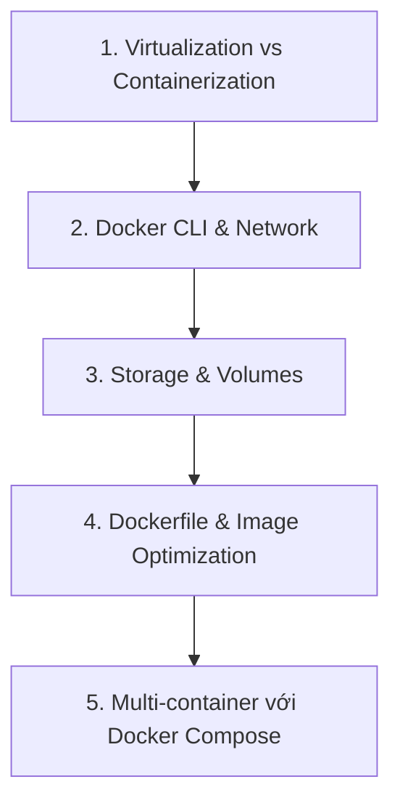

# Lộ trình Đào tạo Docker cho Data Engineer

Docker giúp Data Engineer đóng gói và khởi chạy đồng bộ các dịch vụ dữ liệu trên mọi môi trường. Tài liệu này cung cấp lộ trình chi tiết từng tuần học tập và tài liệu tham khảo cho Docker. Các bài thực hành chi tiết đã được tách thành các tệp tài liệu riêng dưới đây.

---

## 📌 Khung kiến thức chính (Syllabus)

---

## 🗓️ Các bước học tập chi tiết (Step-by-step Agenda)

### Bước 1: Ảo hóa vs Containerization & Docker CLI (Tuần 1 - Ngày 1 đến Ngày 2)
*   **Nội dung:**
    *   Sự khác nhau giữa Virtual Machines (VM) và Containers (Docker). Hiểu tại sao container lại nhẹ và nhanh hơn.
    *   Các khái niệm cốt lõi: Docker Engine, Image, Container, Docker Hub.
    *   Các lệnh CLI quản lý container cơ bản: `docker run`, `docker ps`, `docker logs`, `docker exec`, `docker stop`, `docker rm`.
*   **Tài liệu học tập:**
    *   [Docker Documentation: Get Started](https://docs.docker.com/get-started/)
    *   [Play with Docker](https://labs.play-with-docker.com/)

### Bước 2: Network & Port Mapping (Tuần 1 - Ngày 3)
*   **Nội dung:**
    *   **Port Mapping:** Ánh xạ cổng mạng `-p host_port:container_port` để truy cập ứng dụng chạy bên trong container từ máy Host.
    *   **Docker Networking:** Hiểu driver mặc định `bridge` và cách tạo custom network để các containers gọi nhau bằng tên.
*   **Tài liệu học tập:**
    *   [Docker Documentation: Networking overview](https://docs.docker.com/network/)

### Bước 3: Storage & Volumes (Tuần 1 - Ngày 4 đến Ngày 5)
*   **Nội dung:**
    *   Tính chất tạm thời (ephemeral) của container writable layer.
    *   **Docker Volumes:** Lưu dữ liệu bền vững qua Named Volumes và Bind Mounts.
*   **Bài tập thực hành:**
    *   👉 **[Lab 1: Docker & PostgreSQL Containerization](labs/lab_1_docker_postgres.md)** (Chạy Postgres container, kiểm tra mất dữ liệu khi xóa container và khắc phục bằng Named Volumes).

### Bước 4: Viết Dockerfile & Tối ưu hóa Image (Tuần 2 - Ngày 1 đến Ngày 3)
*   **Nội dung:**
    *   Định nghĩa Dockerfile và các chỉ thị chính: `FROM`, `WORKDIR`, `COPY`, `RUN`, `CMD`.
    *   Quy trình build image: `docker build -t name:tag .`
    *   Tối ưu hóa Dockerfile sử dụng layer caching và chọn base image phù hợp.
*   **Tài liệu học tập:**
    *   [Docker Documentation: Writing a Dockerfile](https://docs.docker.com/develop/develop-images/dockerfile_best-practices/)

### Bước 5: Docker Compose (Tuần 2 - Ngày 4 đến Tuần 3)
*   **Nội dung:**
    *   Khái niệm Compose quản lý multi-container bằng tệp cấu hình `docker-compose.yml`.
    *   Cấu trúc file: services, ports, environment, volumes, networks, depends_on, healthcheck.
    *   Sử dụng biến môi trường từ file `.env` ngoài.
    *   👉 **[Lab 2: Containerize Python App & PostgreSQL Stack](labs/lab_2_compose_stack.md)** (Đóng gói Python Weather Client và kết hợp PostgreSQL DB chạy đồng bộ qua Docker Compose).

---

## 🎯 Đánh giá cuối Giai đoạn
Sau khi hoàn thành các bước tự học và bài thực hành trên, Intern cần chủ động ôn tập và kiểm tra lại kiến thức dựa trên tài liệu checklist:
*   👉 **[Checklist Kiến thức cần nắm được - Docker & Containerization](knowledge_checklist.md)**

