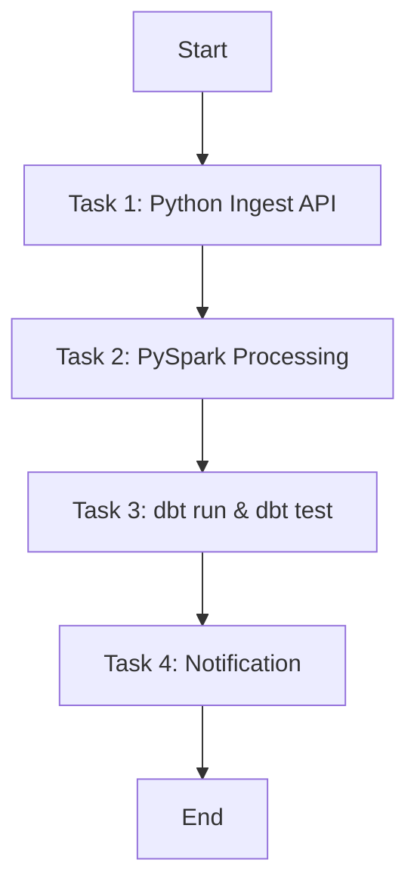

# 📝 Lab 3: Capstone Project - End-to-End Orchestrated Pipeline

Đây là bài thực tập tốt nghiệp (Capstone Project). Intern sẽ vận dụng toàn bộ kiến thức từ thiết kế phần mềm bằng Python, container hóa bằng Docker, biến đổi dữ liệu bằng dbt, xử lý dữ liệu lớn bằng PySpark và điều phối luồng tự động bằng Apache Airflow để tạo ra một hệ thống xử lý dữ liệu tự động hoàn chỉnh.

---

## 🎯 Kiến thức Intern cần nắm được (Target Knowledge)
Sau đồ án Capstone này, Intern phải chứng minh khả năng làm việc độc lập và hiểu rõ:
1.  **Workflow Orchestration (Điều phối quy trình):** Cách thiết lập DAG, quản lý dependency, lập lịch và giám sát trạng thái hệ thống.
2.  **Idempotency (Tính nhất quán chạy lại):** Đảm bảo chạy lại pipeline cho cùng một khoảng thời gian nhiều lần vẫn cho ra kết quả duy nhất mà không bị trùng lặp dữ liệu trong DWH.
3.  **Tích hợp hệ thống (System Integration):** Cách kết hợp các công cụ khác nhau qua các giao thức mạng nội bộ của Docker.
4.  **Pipeline Monitoring & Alerting:** Cơ chế tự động thông báo lỗi từ pipeline về các kênh liên lạc (Slack/Discord/Telegram) khi xảy ra sự cố đột ngột.
5.  **Tài liệu hóa dự án (Production-grade Documentation):** Viết README chuẩn chỉnh để người khác có thể dựng lại toàn bộ hệ thống chỉ bằng 1 câu lệnh.

---

## 📂 Đề bài chi tiết (Detailed Requirements)

### 1. Kịch bản hệ thống
Xây dựng luồng thu thập giá tiền điện tử (CoinGecko API) hoặc dữ liệu thời tiết (Open-Meteo API) hàng ngày, tự động chạy qua các bước Ingest -> Clean/Aggregate -> Transform -> Alert.

### 2. Kiến trúc luồng chi tiết (DAG Workflow):
Intern thiết lập 1 DAG trong Apache Airflow có các tasks sau chạy tuần tự:



*   **Task 1: Python Ingest API (PythonOperator):**
    *   Gọi thư viện Python API Client (ở Lab 1/2 Docker) lấy dữ liệu trong ngày.
    *   Lưu file dữ liệu thô định dạng JSON có dấu thời gian vào thư mục lưu trữ cục bộ: `/data/raw/year=yyyy/month=mm/day=dd/data.json`.
*   **Task 2: PySpark Processing (SparkSubmitOperator hoặc PythonOperator chạy PySpark):**
    *   Khởi chạy Spark job đọc tệp JSON thô của ngày hiện tại.
    *   Xử lý làm sạch, ép kiểu dữ liệu và ghi đè (Overwrite) dữ liệu này vào bảng Bronze/Silver trong PostgreSQL.
*   **Task 3: dbt run & test (BashOperator):**
    *   Gọi dbt thực hiện biến đổi dữ liệu (tầng Marts/Gold) để tổng hợp các chỉ số (ví dụ: trung bình động giá trị 7 ngày, tỉ lệ phần trăm biến động mạnh nhất trong ngày).
    *   Chạy `dbt test` kiểm tra chất lượng dữ liệu cuối cùng.
*   **Task 4: Notification Task:**
    *   Nếu các bước trên chạy thành công, gửi tin nhắn thông báo thành công.
    *   Nếu có bất kỳ task nào lỗi, gửi cảnh báo lỗi kèm nguyên nhân chi tiết về Telegram/Slack Webhook.

---

## 📥 Định nghĩa đầu ra & Sản phẩm bàn giao (Expected Outputs & Deliverables)

### 1. Mã nguồn Git Repository
Toàn bộ mã nguồn được tổ chức sạch sẽ trong thư mục theo đúng cấu trúc Mono-repo đề xuất tại [quy_trinh.md](file:///Users/ducdn/Desktop/Data%20Engineer/intern/03_data_engineering/quy_trinh.md).

### 2. File cấu hình Docker Compose chính
File `docker-compose.yml` khởi chạy toàn bộ dịch vụ (Airflow Webserver, Airflow Scheduler, PostgreSQL Metadata & DWH, Spark local) chạy thành công chỉ với 1 lệnh:
```bash
docker-compose up -d --build
```

### 3. README.md & Video Demo
*   README hướng dẫn setup chi tiết từ số 0, có vẽ sơ đồ kiến trúc dữ liệu bằng Mermaid.
*   Video ngắn hoặc ảnh chụp màn hình ghi lại giao diện Airflow DAG chạy thành công và dữ liệu cuối cùng hiển thị trong DWH.

---

## 📈 Tiêu chí đánh giá của Mentor (Validation Criteria)
1.  **Idempotency Validation:** Mentor chạy lại DAG của ngày hôm qua 3 lần liên tiếp. Kiểm tra trong database: số dòng dữ liệu không được tăng lên (không bị lặp dòng) và kết quả phân tích không bị sai lệch.
2.  **Alerting Setup:** Mentor cố ý ngắt kết nối internet và trigger chạy DAG. Kiểm tra xem Telegram/Slack của Mentor có nhận được thông báo lỗi từ Task 1 không.
3.  **Infrastructure Cleanliness:** Toàn bộ stack dịch vụ (Airflow, Postgres, Spark) phải được cấu hình chạy trong Docker, không yêu cầu cài đặt bất kỳ công cụ nào trực tiếp lên hệ điều hành máy host (ngoài Docker).
