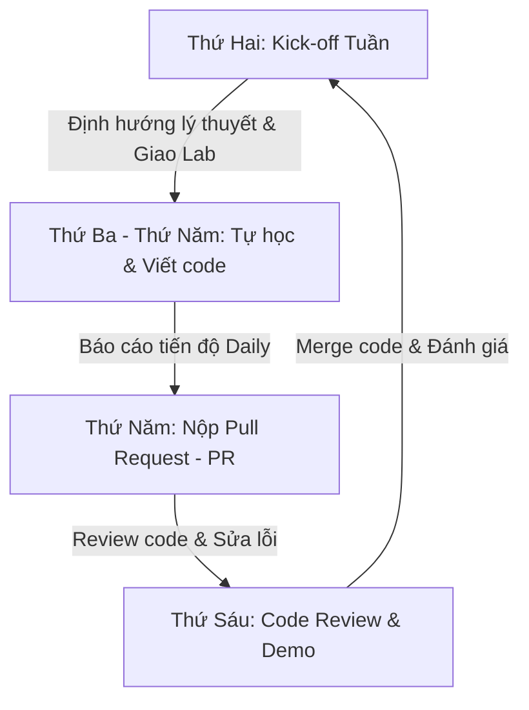

# Quy trình Đào tạo & Giám sát Intern (Training Process)

Tài liệu này thiết lập quy trình vận hành và phối hợp giữa **Mentor** và **Intern** trong suốt 10 tuần đào tạo. Mục tiêu là giúp Intern làm quen với văn hóa làm việc chuyên nghiệp trong dự án thực tế ngay từ ngày đầu tiên.

---

## 🔄 Luồng làm việc Hàng tuần (Weekly Workflow)

Để đảm bảo Intern không bị lạc hướng và Mentor không mất quá nhiều thời gian quản lý, quy trình sẽ vận hành theo vòng lặp 5 ngày như sau:



### 1. Thứ Hai: Khởi động tuần mới (Week Kick-off)
*   **Thời gian:** 30 phút đầu giờ sáng.
*   **Hoạt động:**
    *   Mentor và Intern cùng duyệt qua tiến độ tuần trước.
    *   Mentor giải thích tổng quan về khối lượng kiến thức của tuần này (theo [roadmap.md](file:///Users/ducdn/Desktop/Data%20Engineer/intern/03_data_engineering/roadmap.md)).
    *   Định hướng các tài liệu cần đọc và làm rõ các yêu cầu kỹ thuật của bài Lab tuần đó.

### 2. Thứ Ba - Thứ Năm: Tự học & Phát triển (Self-study & Coding)
*   **Hoạt động:**
    *   Intern dành 70% thời gian để tự đọc tài liệu, nghiên cứu và code bài thực hành.
    *   **Daily Sync (Họp nhanh hàng ngày):** 10-15 phút vào đầu hoặc cuối ngày. Intern trả lời 3 câu hỏi:
        1.  Hôm qua đã hoàn thành được phần nào?
        2.  Hôm nay dự kiến làm phần nào?
        3.  Đang gặp khó khăn/nút thắt (blocker) gì cần Mentor hỗ trợ?
*   *Lưu ý cho Mentor:* Hãy để Intern tự tìm giải pháp trước. Chỉ gợi ý từ khóa hoặc tài liệu tham khảo, tránh viết code hộ.

### 3. Chiều Thứ Năm: Nộp bài thực hành (PR Submission)
*   **Hoạt động:** Intern hoàn thành code và tạo một **Pull Request (PR)** trên Git repository để nộp bài (Xem quy trình Git chi tiết bên dưới). Việc nộp bài vào thứ Năm giúp Mentor có thời gian review code trước buổi họp ngày thứ Sáu.

### 4. Thứ Sáu: Đánh giá & Code Review (Feedback & Demo)
*   **Thời gian:** 45 - 60 phút cuối ngày.
*   **Hoạt động:**
    *   Intern trình bày (demo) sản phẩm chạy thực tế và giải thích giải pháp của mình.
    *   Mentor tiến hành **Code Review** trực tiếp trên PR: Chỉ ra những chỗ code chưa tối ưu (thiếu type hints, đặt tên biến khó hiểu, SQL lồng nhau quá nhiều, thuật toán chạy chậm, thiếu test cases...).
    *   Intern tiếp thu ý kiến, sửa đổi code ngay để Mentor phê duyệt (Approve) và Merge vào nhánh chính (`main`).

---

## 💻 Cấu trúc Repository & Quy trình Git (Git Workflow)

### 💡 Nên lưu các bài Lab riêng biệt hay chung một Project?
Để tối ưu hóa quá trình học tập và kiểm tra, khuyến nghị **lưu tất cả các bài Lab vào chung một Git Repository duy nhất (dạng Mono-repo)**. 

Lý do chọn giải pháp này:
1.  **Tính kế thừa lũy tiến (Incremental/Cumulative Development):** Các bài Lab trong lộ trình này được thiết kế để liên kết chặt chẽ và tái sử dụng code của nhau. Code API Client ở **Lab 1** sẽ được import vào **Lab 2** để ghi dữ liệu vào PostgreSQL. Database của **Lab 2** sẽ làm đầu vào cho **Lab 3** (dbt). Toàn bộ các cấu phần này sẽ được gộp chung để điều phối bằng Airflow trong **Lab 5 (Capstone)**. Việc dùng chung một Repo giúp Intern dễ dàng import và kế thừa mã nguồn qua các tuần mà không cần sao chép file thủ công.
2.  **Dễ dàng giám sát và Review:** Mentor chỉ cần quản lý duy nhất **1 đường dẫn Git**. Mọi lịch sử phát triển, các Pull Request (PR) nộp bài qua từng tuần đều hiển thị tập trung tại một nơi, giúp Mentor dễ dàng theo dõi sự tiến bộ về chất lượng code của Intern theo thời gian.
3.  **Cơ hội xây dựng một Project hoàn chỉnh (Portfolio-ready):** Cuối đợt thực tập, Intern sẽ sở hữu một repository chứa toàn bộ quá trình phát triển từ các bài tập nhỏ đến một hệ thống Data Pipeline hoàn chỉnh, sạch sẽ và chuyên nghiệp để làm sản phẩm tốt nghiệp.

---

### 📂 Cấu trúc thư mục chuẩn đề xuất:
Intern cần tạo và tổ chức thư mục trong Git Repository (Ví dụ đặt tên repo là `de-internship-2026`) theo mẫu sau:

```text
de-internship-2026/          # Root Repository
├── mini-labs/               # Nơi chứa các bài tập khởi động ngắn
│   ├── mini-lab-a/          # Bài tập Python làm sạch file JSON
│   └── mini-lab-b/          # Bài tập Docker chạy Postgres CLI
│
├── weather_pipeline/        # Core Project phát triển lũy tiến qua các tuần
│   ├── weather_client/      # Code từ Lab 1 (Python Client, models, tests)
│   ├── init_db/             # File SQL khởi tạo DB của Lab 2 (init.sql)
│   ├── dbt_project/         # Code biến đổi dữ liệu của Lab 3 (dbt models, tests)
│   ├── spark_jobs/          # Code xử lý dữ liệu lớn của Lab 4 (PySpark)
│   ├── airflow/             # DAGs và cấu hình điều phối của Lab 5 (Airflow)
│   ├── docker-compose.yml   # File Docker Compose chạy toàn bộ stack hệ thống
│   └── .env.example
│
├── sales_analysis/          # Thư mục riêng cho Lab 1.1 (Pandas & NumPy)
├── parallel_pipeline/       # Thư mục riêng cho Lab 1.2 (ProcessPoolExecutor)
└── README.md                # Hướng dẫn chạy và giải thích tổng quan toàn bộ repo
```

---

### 🔧 Quy trình nộp bài qua Git:
Intern bắt buộc phải tuân thủ quy trình nộp bài qua Git để rèn luyện thói quen làm việc thực tế:

1.  **Tạo nhánh làm bài tập mới:**
    *   Từ nhánh chính `main` (hoặc `master`), Intern kéo code mới nhất về và tạo nhánh mới:
        ```bash
        git checkout main
        git pull origin main
        git checkout -b feature/lab-1-weather-client
        ```
    *   Mỗi lần hoàn thành một tính năng nhỏ (ví dụ: viết xong models, viết xong unit tests), thực hiện commit với thông điệp rõ ràng theo chuẩn **Conventional Commits**:
        *   `feat: add weather client class and fetch method`
        *   `test: add unit tests for timeout scenario`
        *   `docs: update readme with setup instructions`
2.  **Nộp bài (Tạo Pull Request):**
    *   Push nhánh làm bài lên GitHub/GitLab:
        ```bash
        git push origin feature/lab-1-weather-client
        ```
    *   Tạo PR từ nhánh `feature/lab-1-weather-client` vào nhánh `main`.
    *   Trong mô tả PR, viết rõ:
        *   Các chức năng đã hoàn thành.
        *   Các thư viện mới đã sử dụng.
        *   Ảnh chụp kết quả chạy test/log thành công.
3.  **Sửa đổi sau Code Review:**
    *   Intern chỉnh sửa code trực tiếp trên nhánh đó dựa trên comment của Mentor và commit bổ sung. Code sẽ tự động cập nhật lên PR.
    *   Sau khi được Approve, thực hiện **Merge** vào nhánh `main` và xóa nhánh feature đi.

---

## 📈 Quy chế Đánh giá & Vượt ải (Assessment & Checkpoints)

Để đảm bảo Intern đạt chất lượng đầu ra tốt nhất, Mentor sẽ đánh giá theo 3 mức độ cho từng bài Lab:

| Kết quả đánh giá | Định nghĩa | Hành động tiếp theo |
| :--- | :--- | :--- |
| **Pass (Đạt)** | Hoàn thành đầy đủ yêu cầu, code sạch, chạy thành công, test coverage đạt chuẩn, giải thích được bản chất kỹ thuật. | Chuyển sang tuần tiếp theo. |
| **Pending (Cần sửa đổi)** | Hoàn thành >70%, code chạy được nhưng chưa tối ưu, thiếu test case hoặc cấu trúc thư mục lộn xộn. | Có 2 ngày (đến hết Chủ nhật) để refactor lại code và nộp lại PR. |
| **Fail (Không đạt)** | Code không chạy được, không hiểu bản chất thuật toán/công cụ sử dụng, copy code mà không giải thích được. | Mentor sẽ có buổi hướng dẫn 1-1 bổ sung và Intern phải làm bài tập phụ. |

### 🎯 Đánh giá Cuối kỳ (Final Capstone Project Defense)
Vào tuần thứ 10, Intern sẽ báo cáo dự án Capstone trước toàn đội ngũ Data Engineer:
*   Trình bày sơ đồ kiến trúc dữ liệu (Data Pipeline Architecture).
*   Giải thích cơ chế xử lý lỗi (Error Handling), bảo mật dữ liệu, giám sát (Monitoring) và giải pháp tối ưu hóa dữ liệu (Partitioning, Broadcast Join).
*   Đánh giá sự tiến bộ về tư duy Software Engineering từ Tuần 1 đến Tuần 10.
