# Data Engineering Internship Training Roadmap (Software & Python First)

Chào mừng bạn đến với lộ trình đào tạo Data Engineering Intern. Lộ trình này được thiết kế trong vòng **10 tuần**, ưu tiên đào tạo nền tảng **Software Engineering, Linux & Python** trước khi đi vào các công nghệ dữ liệu chuyên sâu (SQL, DWH, PySpark, Airflow). Sự thay đổi này giúp Intern có tư duy viết code sạch, dễ bảo trì, biết cách viết tests và tổ chức project chuyên nghiệp.

> [!TIP]
> 📋 **Quy trình Đào tạo & Giám sát:** Xem hướng dẫn vận hành hàng tuần và tiêu chí đánh giá tại file [quy_trinh.md](file:///Users/ducdn/Desktop/Data%20Engineer/intern/03_data_engineering/quy_trinh.md).  
> 🚀 **Hướng dẫn Nộp bài & Tạo PR:** Xem quy trình tạo thư mục, chạy thử, chụp ảnh kết quả và gửi PR tại file [huong_dan_nop_bai.md](file:///Users/ducdn/Desktop/Data%20Engineer/intern/03_data_engineering/huong_dan_nop_bai.md).

---

## 📌 Lộ trình tổng quan (High-Level Roadmap)

```mermaid
gantt
    title Lộ trình Đào tạo Data Engineering Intern (10 Tuần)
    dateFormat  X
    axisFormat %d
    section Phase 0: Linux & Bash
    Terminal CLI, Permissions, Scripting :active, 0, 14
    section Phase 1: Software & Python
    OOP, Clean Code, Testing & Concurrency :active, 0, 21
    section Phase 2: SQL & Modeling
    Postgres SQL, Star Schema & dbt       : 21, 42
    section Phase 3: Big Data
    PySpark & Distributed Processing     : 42, 56
    section Phase 4: Orchestration
    Apache Airflow & End-to-End Pipeline : 56, 70
```

### Các cột mốc quan trọng (Milestones):
*   **Tuần 1:** Hoàn thành [Lab 1 (Linux Basics)](file:///Users/ducdn/Desktop/Data%20Engineer/intern/00_linux/labs/lab_1_linux_basics.md), [Lab 1 (Python Basics)](file:///Users/ducdn/Desktop/Data%20Engineer/intern/01_python/labs/lab_1_basics.md), [Lab 2 (Python Scripting)](file:///Users/ducdn/Desktop/Data%20Engineer/intern/01_python/labs/lab_2_json_cleansing.md), và [Lab 1 (Docker Basics)](file:///Users/ducdn/Desktop/Data%20Engineer/intern/02_docker/labs/lab_1_docker_postgres.md).
*   **Tuần 2:** Hoàn thành [Lab 2 (Linux Vim)](file:///Users/ducdn/Desktop/Data%20Engineer/intern/00_linux/labs/lab_2_vim.md), [Lab 3 (Linux SSH)](file:///Users/ducdn/Desktop/Data%20Engineer/intern/00_linux/labs/lab_3_ssh_networking.md), [Lab 3 (Python OOP Client)](file:///Users/ducdn/Desktop/Data%20Engineer/intern/01_python/labs/lab_3_weather_client.md), [Lab 6 (Generators & Streaming)](file:///Users/ducdn/Desktop/Data%20Engineer/intern/01_python/labs/lab_6_memory_generators.md), và [Lab 7 (Decorators & Resilience)](file:///Users/ducdn/Desktop/Data%20Engineer/intern/01_python/labs/lab_7_decorators_resilience.md) (yêu cầu slide & thuyết trình).
*   **Tuần 3:** Hoàn thành [Lab 4 (Pandas & NumPy)](file:///Users/ducdn/Desktop/Data%20Engineer/intern/01_python/labs/lab_4_pandas_sales.md) và [Lab 5 (Concurrency)](file:///Users/ducdn/Desktop/Data%20Engineer/intern/01_python/labs/lab_5_parallel_processing.md).
*   **Tuần 5:** Hoàn thành [Lab 2 (Docker Compose & DB Ingestion)](file:///Users/ducdn/Desktop/Data%20Engineer/intern/02_docker/labs/lab_2_compose_stack.md).
*   **Tuần 6:** Hoàn thành [Lab 1 (dbt Transformation)](file:///Users/ducdn/Desktop/Data%20Engineer/intern/03_data_engineering/labs/lab_1_dbt.md).
*   **Tuần 8:** Hoàn thành [Lab 2 (PySpark Big Data)](file:///Users/ducdn/Desktop/Data%20Engineer/intern/03_data_engineering/labs/lab_2_pyspark.md).
*   **Tuần 10:** Hoàn thành [Lab 3 (Capstone Project)](file:///Users/ducdn/Desktop/Data%20Engineer/intern/03_data_engineering/labs/lab_3_capstone.md).

---

## 🗓️ Chương trình chi tiết từng tuần (Weekly Agenda)

### Giai đoạn 0: Nền tảng Linux & Bash (Tuần 1 - 2, Học song song với Python)
Mục tiêu: Làm quen với giao diện dòng lệnh, điều khiển hệ thống tệp tin, phân quyền và viết kịch bản tự động hóa đơn giản.
> *   📘 **Linux Roadmap:** [roadmap.md](file:///Users/ducdn/Desktop/Data%20Engineer/intern/00_linux/roadmap.md) (CLI, Permissions, Grep/Find, Redirection, Shell Scripting).
> *   *Thực hành:* Hoàn thành [Lab 1 (Linux Basics)](file:///Users/ducdn/Desktop/Data%20Engineer/intern/00_linux/labs/lab_1_linux_basics.md), [Lab 2 (Linux Vim)](file:///Users/ducdn/Desktop/Data%20Engineer/intern/00_linux/labs/lab_2_vim.md), và [Lab 3 (Linux SSH)](file:///Users/ducdn/Desktop/Data%20Engineer/intern/00_linux/labs/lab_3_ssh_networking.md).

### Giai đoạn 1: Nền tảng Python & Docker (Week 1 - 3)
Mục tiêu: Đạt tư duy viết code của một Software Engineer thực thụ. Biết cách đóng gói ứng dụng bằng Docker, viết code sạch, tổ chức cấu trúc dự án và viết unit tests đầy đủ.

> [!IMPORTANT]
> Giai đoạn này đã được tách thành hai lộ trình chi tiết riêng biệt. Hãy yêu cầu Intern học tập và làm các bài tập khởi động theo tài liệu sau:
> *   📘 **Python Roadmap:** [roadmap.md](file:///Users/ducdn/Desktop/Data%20Engineer/intern/01_python/roadmap.md) (OOP, Type Hinting, Logging, Exception Handling, NumPy, Pandas, Concurrency, Pytest).
> *   🐳 **Docker Roadmap:** [roadmap.md](file:///Users/ducdn/Desktop/Data%20Engineer/intern/02_docker/roadmap.md) (Docker CLI, Networking, Volumes, Dockerfile, Docker Compose).

*   **Tuần 1: Setup Môi trường, Git, Python Cơ bản & Docker CLI**
    *   Học cấu trúc dữ liệu thô (List, Dict, Set, Tuple), xử lý chuỗi và logic lập trình cơ bản.
    *   Học các kỹ năng cơ bản về Bash/Zsh, Git Flow, PEP 8, Virtual Environments (nguyên nhân tránh cài global).
    *   Làm quen với vòng đời container, Port mapping, Volumes trên Docker CLI.
    *   *Thực hành:* Hoàn thành [Lab 1 (Python Basics)](file:///Users/ducdn/Desktop/Data%20Engineer/intern/01_python/labs/lab_1_basics.md), [Lab 2 (Python Scripting)](file:///Users/ducdn/Desktop/Data%20Engineer/intern/01_python/labs/lab_2_json_cleansing.md), và [Lab 1 (Docker Basics)](file:///Users/ducdn/Desktop/Data%20Engineer/intern/02_docker/labs/lab_1_docker_postgres.md).
*   **Tuần 2: Lập trình OOP, Core Python nâng cao & Viết Dockerfile**
    *   Học về OOP trong Python (Class, Inheritance, Encapsulation), Type Hinting, Logging, Custom Exceptions, Decorators, Generators và viết Dockerfile tối ưu.
    *   *Thực hành:* Hoàn thành [Lab 3 (Python OOP Client)](file:///Users/ducdn/Desktop/Data%20Engineer/intern/01_python/labs/lab_3_weather_client.md), [Lab 6 (Generators & Streaming)](file:///Users/ducdn/Desktop/Data%20Engineer/intern/01_python/labs/lab_6_memory_generators.md), và [Lab 7 (Decorators & Resilience)](file:///Users/ducdn/Desktop/Data%20Engineer/intern/01_python/labs/lab_7_decorators_resilience.md) (yêu cầu slide & thuyết trình).
*   **Tuần 3: NumPy, Pandas, Xử lý Song song & Docker Compose**
    *   Biến đổi dữ liệu bảng bằng Pandas/NumPy. Xử lý quét thư mục chứa nhiều file bằng `pathlib`.
    *   Sử dụng `ProcessPoolExecutor` xử lý song song nhiều file tăng tốc hiệu năng.
    *   Viết Unit Tests với `pytest` và mock API responses. Sử dụng Docker Compose kết nối đa container.
    *   *Thực hành:* Hoàn thành [Lab 4 (Pandas & NumPy)](file:///Users/ducdn/Desktop/Data%20Engineer/intern/01_python/labs/lab_4_pandas_sales.md) và [Lab 5 (Concurrency)](file:///Users/ducdn/Desktop/Data%20Engineer/intern/01_python/labs/lab_5_parallel_processing.md).

---

### Giai đoạn 2: SQL, Data Modeling & dbt (Week 4 - 6)
Mục tiêu: Lưu trữ dữ liệu vào Cơ sở dữ liệu quan hệ, thiết kế mô hình dữ liệu tối ưu cho báo cáo và biến đổi dữ liệu (ELT).

*   **Tuần 4: SQL & Relational Databases (PostgreSQL)**
    *   **Lý thuyết & Kỹ năng:**
        *   Làm việc với PostgreSQL qua Docker container (`docker-compose`).
        *   Các khái niệm nâng cao trong RDBMS: Indexes (B-Tree, Hash), Constraints, ACID Transactions.
        *   SQL nâng cao: Window Functions (`ROW_NUMBER()`, `RANK()`, `LEAD()`, `LAG()`), Common Table Expressions (CTEs), Subqueries.
        *   Đọc và tối ưu hóa câu lệnh SQL qua Query Execution Plan (`EXPLAIN ANALYZE`).
    *   **Thực hành:** Bắt đầu cấu hình cơ sở dữ liệu và triển khai [Lab 2 (Docker Compose & DB Ingestion)](file:///Users/ducdn/Desktop/Data%20Engineer/intern/02_docker/labs/lab_2_compose_stack.md).
    *   **Tài liệu đọc:**
        *   PostgreSQL Tutorial (Window Functions & CTEs).

*   **Tuần 5: Data Warehouse Concepts & Dimensional Modeling**
    *   **Lý thuyết & Kỹ năng:**
        *   OLTP vs OLAP.
        *   Thiết kế mô hình dữ liệu Dimensional Modeling (Kimball): Fact tables, Dimension tables (SCD Type 1, Type 2).
        *   Mô hình Star Schema vs Snowflake Schema.
    *   **Thực hành:** Hoàn thành [Lab 2 (Docker Compose & DB Ingestion)](file:///Users/ducdn/Desktop/Data%20Engineer/intern/02_docker/labs/lab_2_compose_stack.md) (Viết Python Repository để ingest dữ liệu vào Postgres và chạy truy vấn phân tích SQL).
    *   **Tài liệu đọc:**
        *   Sách: *The Data Warehouse Toolkit* - Ralph Kimball (Chương 1-3).

*   **Tuần 6: Data Transformation với dbt (Data Build Tool)**
    *   **Lý thuyết & Kỹ năng:**
        *   Triết lý dbt: ELT (Extract-Load-Transform), quản lý mã nguồn SQL biến đổi dữ liệu.
        *   Cấu trúc dự án dbt, Jinja & Macros (`ref()`, `source()`).
        *   Materializations: Table, View, Incremental, Ephemeral.
        *   Data Quality Testing (Schema tests, relationships) & dbt docs.
    *   **Thực hành:** Hoàn thành [Lab 1 (dbt Transformation)](file:///Users/ducdn/Desktop/Data%20Engineer/intern/03_data_engineering/labs/lab_1_dbt.md).
    *   **Tài liệu đọc:**
        *   [dbt Fundamentals Course](https://courses.getdbt.com/courses/dbt-fundamentals) (Free).

---

### Giai đoạn 3: Big Data với PySpark (Week 7 - 8)
Mục tiêu: Hiểu về tính toán phân tán và cách dùng Spark để xử lý tập dữ liệu lớn không thể chứa vừa RAM của một máy đơn lẻ.

*   **Tuần 7: Spark Architecture & PySpark Basics**
    *   **Lý thuyết & Kỹ năng:**
        *   Kiến trúc Spark: Driver, Executors, Cluster Manager, SparkSession.
        *   Cơ chế Lazy Evaluation, Transformations vs Actions, DAG trong Spark.
        *   PySpark DataFrame API & Spark SQL. Đọc/Ghi định dạng Parquet.
    *   **Tài liệu đọc:**
        *   Sách: *Spark: The Definitive Guide* (Chương 1-4).

*   **Tuần 8: PySpark Optimization & Lakehouse Formats**
    *   **Lý thuyết & Kỹ năng:**
        *   Phân vùng dữ liệu (Partitioning & Bucketing).
        *   Out of Memory (OOM), Data Skew và các loại Join (Shuffle Hash Join vs Broadcast Hash Join).
        *   Giới thiệu định dạng Delta Lake / Apache Iceberg (ACID, Time Travel).
    *   **Thực hành:** Hoàn thành [Lab 2 (PySpark Big Data)](file:///Users/ducdn/Desktop/Data%20Engineer/intern/03_data_engineering/labs/lab_2_pyspark.md).
    *   **Tài liệu đọc:**
        *   Spark Performance Tuning Guide.

---

### Giai đoạn 4: Workflow Orchestration & Data Pipeline (Week 9 - 10)
Mục tiêu: Đóng gói toàn bộ kiến thức để xây dựng một hệ thống dẫn truyền dữ liệu tự động, có giám sát và khả năng chịu lỗi (fault-tolerant).

*   **Tuần 9: Workflow Orchestration với Apache Airflow**
    *   **Lý thuyết & Kỹ năng:**
        *   Khái niệm DAG, Webserver, Scheduler, Executor trong Apache Airflow.
        *   Airflow Core Concepts: Operators (BashOperator, PythonOperator, SparkSubmitOperator), Tasks, Tasks Lifecycle.
        *   Truyền tin qua XComs, quản lý Connections & Variables.
        *   Các nguyên tắc thiết kế Pipeline: Idempotency, Backfill, Catchup.
    *   **Tài liệu đọc:**
        *   Astronomer Airflow Guides.

*   **Tuần 10: Capstone Project & Best Practices**
    *   **Lý thuyết & Kỹ năng:**
        *   Data Pipeline Monitoring & Alerting (Slack/Telegram integration).
        *   CI/CD cơ bản cho Data Pipeline (linters, pre-commit, automated testing).
        *   Hoàn thiện Capstone Project và báo cáo kết quả (Slide presentation/Demo).
    *   **Thực hành:** Hoàn thành [Lab 3 (Capstone Project)](file:///Users/ducdn/Desktop/Data%20Engineer/intern/03_data_engineering/labs/lab_3_capstone.md).
