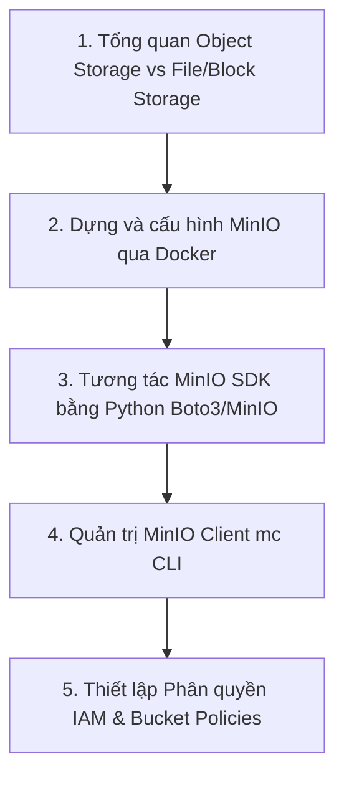

# Lộ trình Học Object Storage & MinIO cho Data Engineer

Trong kiến trúc dữ liệu hiện đại, **Object Storage** (như AWS S3, Google Cloud Storage và MinIO) đóng vai trò là "Landing Zone" hoặc "Data Lake" chính để lưu trữ mọi loại dữ liệu thô (Raw Data), bán cấu trúc (Semi-structured) hay phi cấu trúc (Unstructured). Việc làm chủ cách thiết lập, quản trị và lập trình tương tác với Object Storage là kỹ năng thiết yếu đối với mỗi Data Engineer.

---

## 📌 Khung kiến thức chính (Syllabus)

---

## 🗓️ Các bước học tập chi tiết (Step-by-step Agenda)

### Bước 1: Tổng quan Object Storage & Cài đặt MinIO (Tuần 4)
*   **Nội dung:**
    *   Phân biệt Object Storage với File System (NFS) và Block Storage (SAN/EBS). Hiểu tại sao Object Storage có khả năng mở rộng (scalability) vượt trội và chi phí rẻ.
    *   Các khái niệm cốt lưu: Buckets (thùng chứa), Objects (đối tượng bao gồm Data + Metadata + Key), S3-compatible API.
    *   Cách dựng MinIO Server bằng Docker và Docker Compose. Sử dụng MinIO Console để thao tác giao diện Web.
*   **Tài liệu học tập:**
    *   [MinIO Quickstart Guide](https://min.io/docs/minio/container/index.html)
    *   [AWS S3 Core Concepts](https://docs.aws.amazon.com/AmazonS3/latest/userguide/Welcome.html)

### Bước 2: Tương tác với MinIO thông qua Python SDK (Tuần 4)
*   **Nội dung:**
    *   Kết nối đến MinIO Server từ ứng dụng Python bằng thư viện `boto3` (thư viện S3 chuẩn của AWS) hoặc `minio` (SDK chính thức của MinIO).
    *   Quản lý Buckets: Kiểm tra sự tồn tại (`bucket_exists` / `head_bucket`), tạo bucket (`make_bucket` / `create_bucket`).
    *   Quản lý Objects: Upload tệp (`put_object` / `upload_file`), download tệp (`get_object` / `download_file`), xóa tệp (`remove_object`).
    *   Xử lý lỗi kết nối và xác thực quyền truy cập (`ClientError`, `S3UploadFailedError`).
*   **Bài tập thực hành:**
    *   👉 **[Lab 1: Đọc dữ liệu từ file CSV và lưu vào MinIO](labs/lab_1_csv_to_minio.md)** (Dựng MinIO bằng Docker Compose, viết script Python đọc dữ liệu CSV, cấu hình kết nối bảo mật bằng `.env` và upload lên MinIO).

### Bước 3: Sử dụng MinIO Client CLI (`mc`) & Phân quyền (Tuần 4)
*   **Nội dung:**
    *   Cài đặt công cụ dòng lệnh MinIO Client (`mc`).
    *   Liên kết cấu hình kết nối (`mc alias set`).
    *   Các lệnh CLI phổ biến: `mc ls`, `mc mb` (make bucket), `mc cp` (copy), `mc rm` (remove), `mc mirror` (đồng bộ thư mục).
    *   Cơ chế phân quyền truy cập: Public, Private, Custom Policies. Chia sẻ tệp có thời hạn (Presigned URLs) bằng lệnh `mc share`.
*   **Tài liệu học tập:**
    *   [MinIO Client (mc) Complete Guide](https://min.io/docs/minio/linux/reference/minio-cli.html)

---

## 🎯 Đánh giá cuối Giai đoạn
Sau khi hoàn thành các bước tự học và bài thực hành trên, Intern cần chủ động ôn tập và kiểm tra lại kiến thức dựa trên tài liệu checklist:
*   👉 **[Checklist Kiến thức cần nắm được - Object Storage & MinIO](knowledge_checklist.md)**

