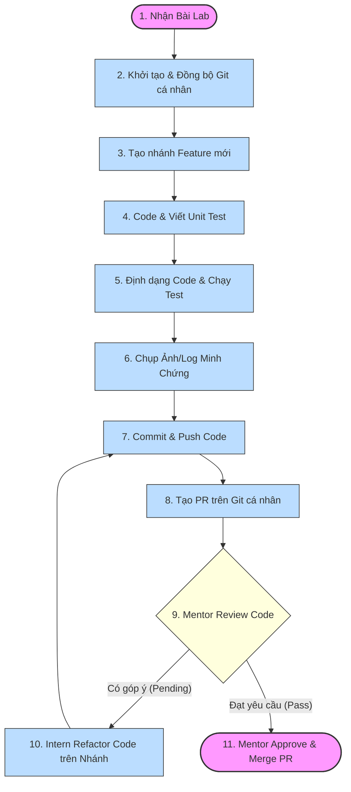
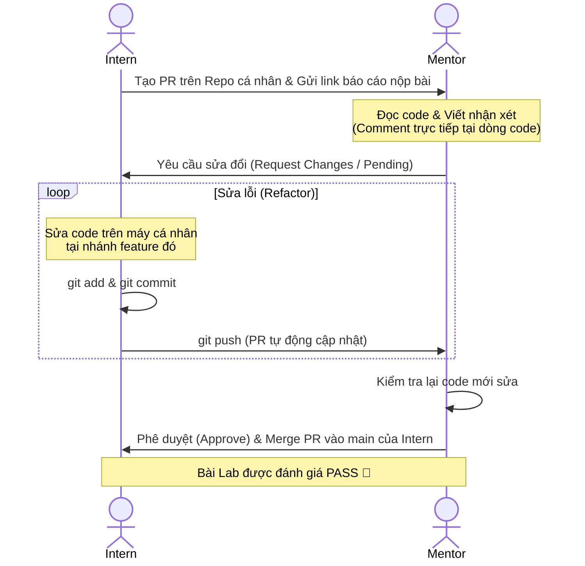

# 📖 HƯỚNG DẪN QUY TRÌNH NỘP BÀI THỰC HÀNH & GỬI PULL REQUEST (PR)
> **Tài liệu hướng dẫn từ Tổng quan đến Chi tiết dành cho Data Engineering Intern**

Tài liệu này được thiết kế để chuẩn hóa quy trình nộp bài thực hành hàng tuần của Intern. Việc tuân thủ quy trình này không chỉ giúp Mentor dễ dàng theo dõi, đánh giá kết quả học tập mà còn giúp Intern rèn luyện tư duy làm việc chuyên nghiệp theo chuẩn **Software Development Life Cycle (SDLC)** tại các dự án thực tế.

---

## 📌 PHẦN 1: TỔNG QUAN QUY TRÌNH (HIGH-LEVEL OVERVIEW)

Dưới đây là sơ đồ tổng quan vòng đời của một bài Lab từ lúc Intern bắt đầu nhận yêu cầu cho đến khi bài Lab được chính thức công nhận đạt yêu cầu (Merged).



### 💡 Các cột mốc chính trong quy trình:
1. **Khởi tạo:** Intern tạo và quản lý bài nộp trên **Repository cá nhân** của mình trên GitHub/GitLab, thêm Mentor vào review.
2. **Thực thi:** Code logic kết hợp viết kiểm thử (Unit Test), định dạng code sạch sẽ.
3. **Minh chứng:** Lưu lại kết quả chạy thành công (ảnh Terminal, log, kết quả database).
4. **Nộp bài:** Tạo Pull Request (PR) đính kèm mô tả chi tiết và ảnh minh chứng.
5. **Cải thiện:** Phối hợp cùng Mentor phản hồi nhận xét (Code Review) để tối ưu hóa mã nguồn.

---

## 🛠️ PHẦN 2: HƯỚNG DẪN KHỞI TẠO REPOSITORY CÁ NHÂN (INITIAL SETUP)

Để tránh làm loãng mã nguồn của repository giáo trình gốc, mỗi Intern sẽ làm bài và nộp bài trên một Git Repository cá nhân riêng biệt.

### Bước 2.1: Tạo Repository mới trên GitHub/GitLab của Intern
1. Truy cập vào tài khoản GitHub/GitLab cá nhân của bạn.
2. Tạo một Repository mới với các thông tin sau:
   * **Repository name:** `de-internship-2026`
   * **Visibility:** Chọn **Private** (để bảo mật bài làm của bạn, chỉ bạn và Mentor có quyền xem).
   * **Initialize this repository with:** Không chọn bất kỳ tùy chọn nào (không add README, `.gitignore` hay License từ template có sẵn).

### Bước 2.2: Thêm Mentor làm Cộng tác viên (Collaborator)
Để Mentor có quyền truy cập vào Repo Private của bạn nhằm xem code, viết comment và Approve PR:
1. Tại giao diện Repository cá nhân vừa tạo, chọn **Settings** (Cài đặt).
2. Chọn mục **Collaborators** (Cộng tác viên) ở thanh menu bên trái.
3. Nhấp chọn **Add people** (Thêm người).
4. Nhập **Username** Git của Mentor của bạn, chọn và bấm gửi lời mời.
5. *Lưu ý:* Intern cần báo cho Mentor kiểm tra email hoặc thông báo trên Git để chấp nhận lời mời tham gia dự án.

### Bước 2.3: Khởi tạo Local Repository & Push commit đầu tiên
Mở Terminal trên máy tính của bạn và thực hiện các lệnh sau để liên kết thư mục làm bài trên máy với Git Repository cá nhân vừa tạo:

```bash
# 1. Tạo thư mục làm bài trên máy cá nhân
mkdir de-internship-2026
cd de-internship-2026

# 2. Khởi tạo Git cục bộ
git init

# 3. Tạo file README.md cơ bản
echo "# Data Engineering Internship 2026 Solutions" > README.md

# 4. Định nghĩa nhánh mặc định là main
git branch -M main

# 5. Liên kết với repository online của bạn (Thay URL bằng link repo cá nhân của bạn)
git remote add origin https://github.com/<YOUR_USERNAME>/de-internship-2026.git

# 6. Add và commit file README đầu tiên
git add README.md
git commit -m "chore: initial commit"

# 7. Push commit đầu tiên lên Git cá nhân
git push -u origin main
```

---

## 📂 PHẦN 3: CẤU TRÚC THƯ MỤC & ĐÓNG GÓI CODE (REPOSITORY STRUCTURE)

Intern tổ chức các thư mục tương ứng với các giai đoạn của curriculum ngay trong thư mục gốc `de-internship-2026` vừa tạo.

> [!IMPORTANT]
> **Quy tắc tạo thư mục lũy tiến:**
> Intern **KHÔNG** tạo toàn bộ các thư mục này cùng một lúc từ đầu. Học đến tuần nào hoặc giai đoạn nào thì mới khởi tạo thư mục của giai đoạn đó. 
> *Ví dụ: Ở tuần đầu tiên học Linux, repo của bạn sẽ chỉ có các file cấu hình gốc, thư mục `00_linux_labs/` và thư mục `docs/screenshots/` để chứa ảnh.*

### 3.1 Cấu trúc thư mục chuẩn (Khi đã hoàn thành đầy đủ)
```text
de-internship-2026/             # Thư mục gốc của Git Repository cá nhân
│
├── .gitignore                  # File cấu hình bỏ qua file rác (Bắt buộc)
├── README.md                   # Hướng dẫn tổng quan cách cài đặt & chạy project
│
├── 00_linux_labs/              # Các bài tập giai đoạn Linux & Bash Shell
│   ├── lab_1_cli_basics/       # Phân quyền, thao tác file và thư mục cơ bản
│   │   ├── screenshots/        # Lưu trữ ảnh minh chứng riêng của Lab này
│   │   │   └── lab_0_bash.png
│   │   └── ...
│   └── lab_2_bash_script/
│
├── 01_python_labs/             # Các bài tập giai đoạn Python
│   ├── lab_1_basics/           # Bài tập cơ bản
│   │   ├── screenshots/        # Ảnh minh chứng của Lab Python Basics
│   │   │   └── lab_1_console.png
│   │   ├── basics_practice.py
│   │   └── README.md
│   └── ...
│
├── 02_docker_labs/             # Các bài tập giai đoạn Docker
│   ├── lab_1_postgres/
│   │   ├── screenshots/
│   │   │   └── lab_2_dbeaver.png
│   │   └── ...
│   └── lab_2_compose_stack/
│
├── 03_de_labs/                 # Các bài tập Data Engineering nâng cao
│   ├── lab_1_dbt/              # Models dbt transformation
│   └── lab_2_spark/            # Code PySpark processing
│
└── 04_minio_labs/              # Các bài tập giai đoạn Object Storage
    └── lab_1_csv_to_minio/
```

### 3.2 Quy tắc thiết lập `.gitignore` chống file rác
> [!IMPORTANT]
> **Quy tắc vàng:** Tuyệt đối không được push các thư mục chứa môi trường ảo, cache, file log cá nhân hoặc credentials lên Git.

Dưới đây là nội dung file `.gitignore` mẫu mà Intern phải tạo ở thư mục gốc của repository:

```ini
# --- Môi trường ảo (Python Virtual Environments) ---
.venv/
venv/
env/
ENV/
*.pyc
__pycache__/
.pytest_cache/
.ipynb_checkpoints/

# --- IDE & Editors ---
.vscode/
.idea/
*.suo
*.ntvs*
*.njsproj
*.sln

# --- Database & Storage Volumes (Cực kỳ quan trọng) ---
pg_data/
minio_data/
*.db
*.sqlite3

# --- File Logs & Kết quả tạm ---
*.log
logs/
temp/
tmp/
.env

# --- File hệ điều hành ---
.DS_Store
Thumbs.db
```

---

## 🌿 PHẦN 4: QUY TRÌNH THAO TÁC GIT & CONVENTIONAL COMMITS

Để lịch sử Git của dự án sạch sẽ và dễ theo dõi, Intern cần tuân thủ nghiêm ngặt các quy tắc thao tác Git dưới đây.

### 4.1 Quy trình tạo nhánh (Branching Flow)

> [!IMPORTANT]
> **Quy tắc quan trọng về nhánh (Branching Rules):**
> *   **Lần đầu tạo project & Bài Lab đầu tiên (Ví dụ: Lab 0 Linux):** Intern thực hiện khởi tạo cấu trúc thư mục, code và push commit **TRỰC TIẾP lên nhánh `main`**. Chưa cần tạo nhánh hay PR ở bước này để dễ dàng thiết lập khung sườn ban đầu của dự án.
> *   **Kể từ các bài Lab tiếp theo trở đi (Ví dụ: Lab 1 Python trở đi):** Tuyệt đối **KHÔNG** được commit trực tiếp lên `main`. Bắt buộc phải tạo nhánh mới (feature branch) từ `main`, hoàn thành bài làm, mở Pull Request (PR) để Mentor review và Approve mới được merge lại vào `main`.

#### Các bước làm bài kể từ bài Lab thứ 2 trở đi:

```bash
# Bước A: Chuyển về nhánh main chính
git checkout main

# Bước B: Đồng bộ code mới nhất từ remote server cá nhân về máy (nếu làm trên nhiều máy)
git pull origin main

# Bước C: Tạo và chuyển sang nhánh mới để làm bài
git checkout -b feature/lab-{số_tuần}-{tên_bài_lab}
```

*Ví dụ đặt tên nhánh cho các bài sau:*
*   `feature/lab-1-python-basics`
*   `feature/lab-2-docker-compose`
*   `bugfix/lab-2-fix-db-connection`

---

### 4.2 Quy tắc viết Commit (Conventional Commits)
Để quản lý lịch sử Git chuyên nghiệp, Intern cần tuân thủ tiêu chuẩn viết commit message. Tham khảo chi tiết tại trang chủ: [Conventional Commits Specification](https://www.conventionalcommits.org/vi/v1.0.0/) (bản tiếng Việt) hoặc [Conventional Commits](https://www.conventionalcommits.org/).

Cấu trúc cơ bản của một commit message:
`[loại_commit]: [mô tả ngắn bằng tiếng Anh hoặc tiếng Việt không dấu]`

Các `loại_commit` thường dùng bao gồm:
*   `feat`: Khi thêm tính năng mới hoặc bắt đầu viết một bài tập mới.
*   `fix`: Khi sửa lỗi logic, sửa code chạy sai.
*   `test`: Khi viết thêm các ca kiểm thử (Unit Tests).
*   `docs`: Khi viết tài liệu README hoặc thêm ảnh chụp kết quả.
*   `refactor`: Khi tối ưu hóa code (giảm thời gian chạy, cấu trúc lại thư mục) mà không thay đổi kết quả đầu ra.

*Ví dụ chuỗi commit chuẩn:*
```bash
git add 00_linux_labs/lab_2_bash_script/
git commit -m "feat: complete script to monitor system resource logs"
git add 00_linux_labs/lab_2_bash_script/screenshots/
git commit -m "docs: add backup script run result screenshots for lab 0"
git push origin feature/lab-0-linux-basics
```

---

## 💻 PHẦN 5: ĐẢM BẢO CHẤT LƯỢNG & TẠO MINH CHỨNG (QUALITY ASSURANCE)

Trước khi gửi PR, Intern phải tự kiểm tra chất lượng code và chuẩn bị minh chứng chạy thành công.

### 5.1 Định dạng code (Code Formatting)
*   Khuyến khích sử dụng công cụ format code chuẩn như `black` hoặc `ruff` để đảm bảo code sạch sẽ, thụt lề chuẩn PEP 8.
*   *Lưu ý:* Xóa bỏ các dòng print thừa, code nháp không sử dụng trước khi commit.

### 5.2 Chạy Unit Test & Đánh giá Code Coverage
Nếu bài thực hành có sẵn bộ test hoặc yêu cầu viết test:
1.  Chạy toàn bộ test suite để đảm bảo không bị lỗi:
    ```bash
    pytest tests/
    ```
2.  Kiểm tra độ bao phủ (Coverage) nếu có yêu cầu:
    ```bash
    pytest --cov=src tests/
    ```

### 5.3 Chuẩn bị ảnh và log minh chứng (Evidence Capture)
Intern bắt buộc phải chuẩn bị hình ảnh hoặc log để chứng minh code đã chạy đúng:
*   **Ảnh Terminal / Script output:** Chụp rõ lệnh chạy file Bash Shell (`.sh`) hoặc script Python và kết quả in ra màn hình.
*   **Ảnh Database (Nếu có):** Chụp kết quả truy vấn dữ liệu từ các công cụ như DBeaver, pgAdmin thể hiện bảng đã được tạo và dữ liệu đã được nạp.
*   **Ảnh UI/MinIO (Nếu có):** Chụp giao diện web MinIO thể hiện file đã được upload thành công lên bucket.
*   **Quy định lưu trữ:** Tất cả ảnh chụp minh chứng cho bài Lab nào phải được lưu tại thư mục `screenshots/` nằm ngay bên trong thư mục của bài Lab đó (Ví dụ: `00_linux_labs/lab_1_cli_basics/screenshots/`). Cách này giúp mã nguồn và tài liệu của mỗi bài Lab hoàn toàn độc lập và tự đóng gói.

---

## 📝 PHẦN 6: TẠO PULL REQUEST (PR) & MẪU PR TEMPLATE

Khi code đã được push lên GitHub/GitLab của bạn, hãy tiến hành mở một Pull Request từ nhánh làm bài của bạn (ví dụ: `feature/lab-0-linux-basics`) vào nhánh `main` của chính **repository cá nhân của bạn**.

### 6.1 Quy tắc đặt tiêu đề PR
Đặt tiêu đề PR theo mẫu sau để Mentor dễ quản lý:
`[Lab {Số tuần}] {Tên Bài Lab} - {Họ và Tên Intern}`

*Ví dụ:* `[Lab 0] Linux & Bash Scripting - Nguyễn Văn A`

---

### 6.2 Mẫu mô tả Pull Request (PR Template)
> [!TIP]
> Hãy copy toàn bộ nội dung trong khung dưới đây, dán vào phần Description của Pull Request của bạn và hoàn thiện đầy đủ các mục.

```markdown
## 📝 MÔ TẢ BÀI THỰC HÀNH NỘP: [Tên Bài Lab]

### 👤 Thông tin Intern
*   Họ và tên: [Điền họ và tên của bạn]
*   Tuần thực tập: Tuần [Ví dụ: Tuần 0]
*   Mentor phụ trách: [Điền tên Mentor của bạn]

---

### 📦 Các phần đã hoàn thành (Checklist)
*Đánh dấu `[x]` vào các phần đã hoàn thành và `[ ]` vào các phần chưa hoàn thành.*
- [x] Bài tập 1: Phân quyền chmod/chown cho file log ứng dụng.
- [x] Bài tập 2: Viết script Bash tự động dọn dẹp các tệp tin tạm và ghi log báo cáo.
- [x] Đã thiết lập cấu hình chmod chạy thực thi (+x) cho script.
- [ ] Bài tập 3: Cấu hình Cron Job tự động hóa việc dọn dẹp logs.

---

### 💻 Minh chứng chạy thành công (Screenshots & Logs)

#### 1. Kết quả chạy chương trình trên Console/Terminal:

*(Giải thích ngắn gọn hình ảnh trên: Script chạy backup thành công 5 files log từ thư mục logs/ sang backup/)*

#### 2. Kết quả kiểm tra Database / Object Storage / Thư mục đích (nếu có):
```text
[Dán một đoạn log tiêu biểu khi chạy hoặc cấu hình cron tab tại đây]
```

---

### 🧠 Kiến thức đã làm chủ được sau bài Lab này
1.  [Ví dụ: Hiểu cơ chế phân quyền octal (755, 644) và cách chuyển quyền sở hữu file cho user/group].
2.  [Ví dụ: Biết cách debug script bash bằng cách thêm cờ set -x hoặc set -e để dừng script ngay khi gặp lỗi].

---

### ❓ Câu hỏi hoặc Khó khăn gặp phải (nếu có)
*   [Ví dụ: Em chưa rõ cơ chế tối ưu khi truyền tham số động từ ngoài vào cron job].
```

---

## 📈 PHẦN 7: QUY TRÌNH CODE REVIEW & PHỐI HỢP CÙNG MENTOR

Sau khi PR được tạo, quy trình review và phản hồi trên Repo cá nhân sẽ diễn ra như sau:



### 7.1 Phản hồi góp ý của Mentor
1.  **Đọc kỹ comment:** Mentor sẽ để lại ý kiến ngay trên dòng code chưa tối ưu của PR trên Git của bạn.
2.  **Sửa lỗi ngay trên nhánh hiện tại:** Tuyệt đối **không** đóng PR hiện tại hoặc tạo PR mới. Chỉ cần thực hiện sửa code trên máy cá nhân tại đúng nhánh đó.
3.  **Commit & Push:** Commit và push code như bình thường. PR sẽ tự động ghi nhận thay đổi mới.
4.  **Phản hồi:** Trả lời trực tiếp vào thread comment của Mentor trên PR (ví dụ: "Đã sửa", "Em đã tối ưu lại theo gợi ý", hoặc giải thích lý do tại sao viết như vậy nếu có quan điểm khác).

### 7.2 Các mức đánh giá bài Lab từ Mentor
*   **PASS (Đạt):** Code chạy đúng logic, sạch sẽ, có đầy đủ minh chứng, giải thích được bản chất kỹ thuật khi demo.
*   **PENDING (Cần chỉnh sửa):** Code chạy được nhưng chưa tối ưu, thiếu test cases hoặc cấu trúc thư mục lộn xộn. Intern có 2 ngày để sửa lại.
*   **FAIL (Không đạt):** Code lỗi không chạy được, không hiểu code mình viết hoặc sao chép bài làm của người khác mà không giải thích được. Mentor sẽ hẹn gặp 1-1 để hỗ trợ và Intern phải hoàn thành bài tập bổ sung.
