# Data Engineering Internship Curriculum

Chào mừng đến với kho học liệu lộ trình đào tạo **Data Engineering Intern** (10 tuần). Chương trình này được thiết kế nhằm ưu tiên phát triển nền tảng **Software Engineering & Python** trước khi đi sâu vào các công cụ và hạ tầng dữ liệu nâng cao.

---

## 📌 Tổng quan lộ trình 10 tuần (High-Level Roadmap)

```mermaid
gantt
    title Lộ trình Đào tạo Data Engineering Intern (10 Tuần)
    dateFormat  X
    axisFormat %d
    section Phase 1: Software & Python
    OOP, Clean Code, Testing & Git       :active, 0, 21
    section Phase 2: SQL & Modeling
    Postgres SQL, Star Schema & dbt       : 21, 42
    section Phase 3: Big Data
    PySpark & Distributed Processing     : 42, 56
    section Phase 4: Orchestration
    Apache Airflow & End-to-End Pipeline : 56, 70
```

---

## 📂 Cơ cấu Thư mục Giáo trình

Tài liệu được phân chia thành 3 giai đoạn đào tạo chính:

*   📂 **[01_python/](file:///Users/ducdn/Desktop/Data%20Engineer/intern/01_python/roadmap.md):** Đào tạo lập trình Python nâng cao (OOP, Clean Code, Pytest Unit Testing, Generators tối ưu bộ nhớ, Custom Decorators chịu lỗi, Concurrency).
*   📂 **[02_docker/](file:///Users/ducdn/Desktop/Data%20Engineer/intern/02_docker/roadmap.md):** Đóng gói ứng dụng, tối ưu Layer Cache, làm quen với Postgres DB, Port mapping và liên kết multi-container bằng Docker Compose.
*   📂 **[03_data_engineering/](file:///Users/ducdn/Desktop/Data%20Engineer/intern/03_data_engineering/roadmap.md):** Lộ trình Data Engineering tổng quan, Quy trình sync hàng tuần, Hướng dẫn nộp bài tạo PR, và các bài Lab lớn về dbt, PySpark, Capstone Project (Airflow).

---

## 🚀 Hướng dẫn nhanh cho Intern & Mentor

1.  **Intern:** Hãy bắt đầu đọc tài liệu **[Quy trình Đào tạo](file:///Users/ducdn/Desktop/Data%20Engineer/intern/03_data_engineering/quy_trinh.md)** và **[Hướng dẫn Nộp bài & Gửi PR](file:///Users/ducdn/Desktop/Data%20Engineer/intern/03_data_engineering/huong_dan_nop_bai.md)** để nắm rõ cách tạo nhánh Git và chuẩn bị ảnh minh chứng chạy kết quả.
2.  **Học tập hàng tuần:** Duyệt qua roadmap của từng giai đoạn và thực hành các bài Lab theo thứ tự tăng dần từ dễ đến khó trong thư mục `labs/` của mỗi phần.
3.  **Mentor:** Thực hiện code review trên Pull Request của Intern dựa trên các **Tiêu chí đánh giá** có sẵn ở cuối mỗi bài Lab.
